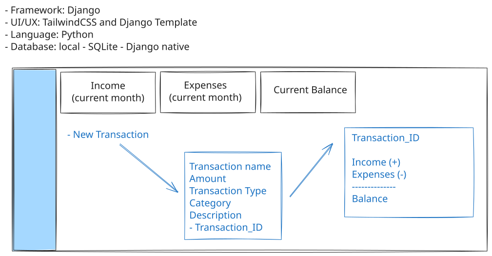
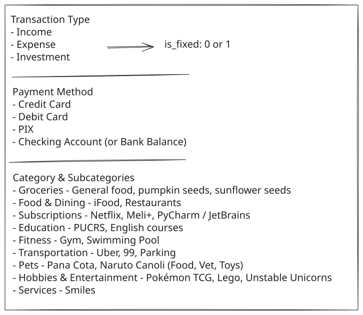
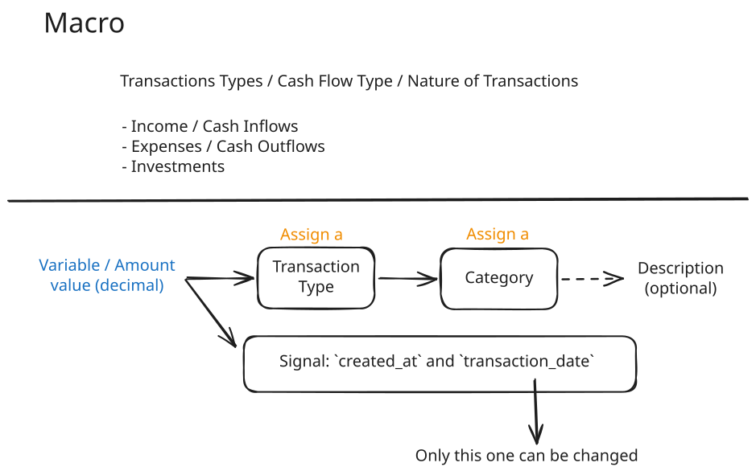
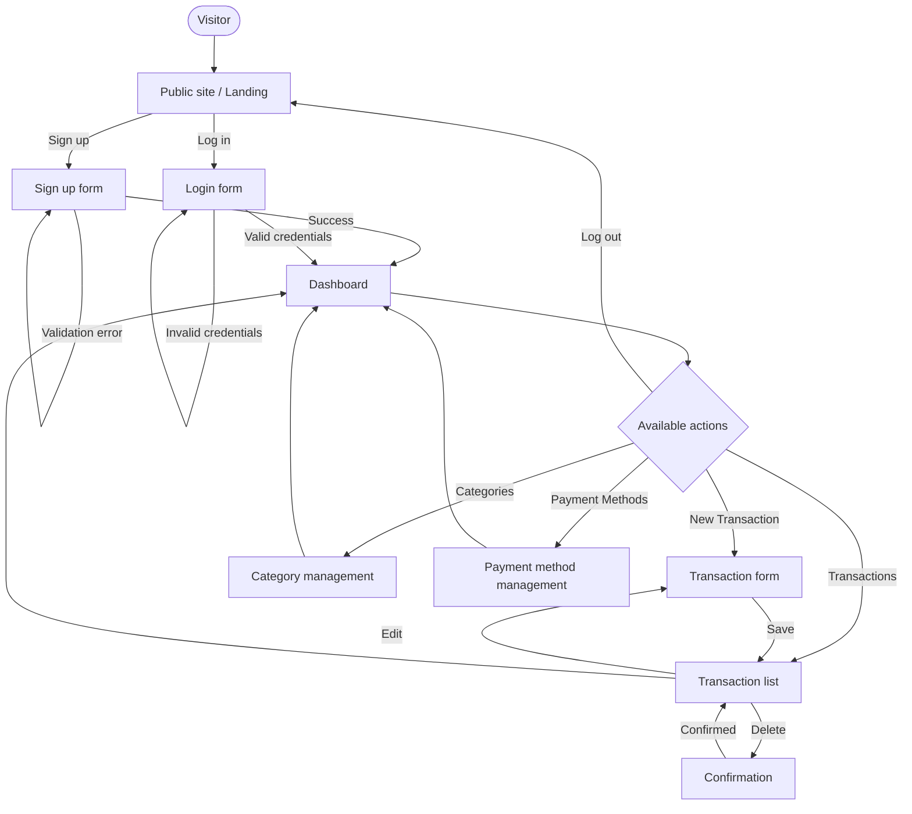
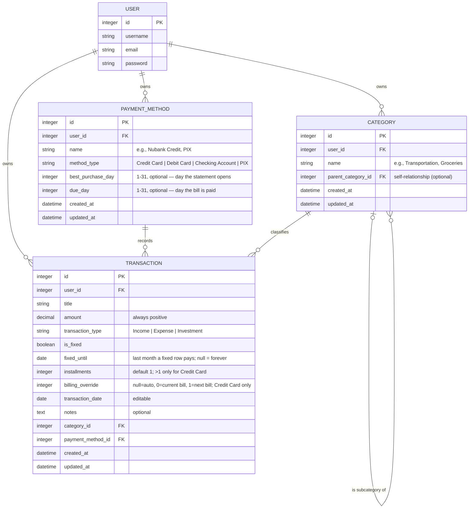

# PRD — CashFlow (Django Personal Finance Tracker)

> **Product Requirements Document**
> Project: `django-finance-template`
> Stack: Python · Django (full stack) · Django Template Language · TailwindCSS · SQLite
> Code and product language: **English** · Document language: **English**
> Last updated: 2026-07-25

---

## Initial Visual References

The images below are the project's starting point (scope, domain, and UI drafts). They serve as the source of truth for vocabulary, entities, and the dashboard wireframe.

### 1. Project Information and Dashboard Wireframe


- Framework: **Django** · UI/UX: **TailwindCSS + Django Template** · Language: **Python** · Database: **SQLite (Django native)**
- Dashboard cards: **Income (current month)**, **Expenses (current month)**, **Current Balance**.
- **New Transaction** flow with fields: `Transaction name`, `Amount`, `Transaction Type`, `Category`, `Description`.

### 2. Domain: Types, Categories, and Payment Methods


- **Transaction Type:** Income · Expense · Investment.
- **Category & Subcategories:** Groceries, Food & Dining, Subscriptions, Education, Fitness, Transportation, Pets, Hobbies & Entertainment, Services.
- **Payment Method:** Credit Card, Debit Card, PIX, Checking Account.
- **`is_fixed`:** 0 or 1 (recurring vs. variable).

### 3. Macro Cash Flow Structure


- Macro: **Income / Cash Inflows**, **Expenses / Cash Outflows**, **Investments**.
- `amount` always positive (decimal); the **sign** is derived from `transaction_type`.
- Dates: `created_at` (immutable) and `transaction_date` (the only user-editable one).

---

## 1. Overview

**CashFlow** is a web-based personal finance tracking application built with Django full stack. Its goal is to provide a clear, immediate view of personal cash flow — current balance, monthly inflows and outflows, and classification of day-to-day transactions — replacing spreadsheet-based tracking (a single column with +/− signs) with a normalized relational database.

The product has two parts: a **public presentation site** (landing page with sign up and log in options) and an **authenticated area** (dashboard and transaction management). The project is deliberately **simple and lean**, with no over-engineering: it uses Django's native authentication, SQLite, and Django Template Language with TailwindCSS.

---

## 2. About the Product

CashFlow lets the user record categorized financial transactions, classify them by type (Income, Expense, Investment) and payment method, and track aggregated indicators on a dashboard. Each transaction stores an **absolute** value (`amount` always positive); whether it is an inflow or outflow is derived from `transaction_type`, avoiding sign ambiguity.

Scope differentiators:
- Standardized English financial vocabulary (Current Balance, Income, Expenses, Groceries, Subscriptions, etc.).
- Categories with **subcategories** (self-relationship), e.g., `Uber` → `Transportation`.
- Distinction between **fixed/recurring** and **variable** expenses via the `is_fixed` flag.
- A single visual identity and a **design system** applied to every screen.

---

## 3. Purpose

Give the user control and clarity over their personal finances through:
1. **Structured recording** of transactions (instead of a spreadsheet).
2. **Consistent classification** (category, subcategory, payment method, type).
3. **Consolidated view** of period performance (monthly Balance) and availability (Current Balance).

---

## 4. Target Audience

- **Primary user:** an individual who currently tracks finances in a spreadsheet and wants a more organized, visual, and fast tool.
- **Profile:** individuals who record recurring expenses (subscriptions, transportation, food) and want to understand where their money goes each month.
- **Context:** personal use, single-user per instance (each user sees only their own data).

---

## 5. Goals

| # | Goal | Expected result |
|---|------|-----------------|
| G1 | Replace the spreadsheet with a relational app | Record a transaction in < 30s |
| G2 | Provide a consolidated monthly view | Dashboard with 6 key indicators, a month outlook, and evolution charts |
| G3 | Standardize categorization | Reusable categories + subcategories |
| G4 | Consistent, modern design | Single design system across all screens |
| G5 | Simple, maintainable codebase | CBVs, PEP8, apps by domain |

**Non-goals (out of initial scope):** collaborative multi-user, banking/Open Finance integration, native mobile app, multi-currency *within one instance* (FR20 makes the currency configurable project-wide, but an instance still has exactly one — no per-transaction currency, no FX conversion), statement imports.

> **Scope change (2026-07-25):** "advanced reports/complex charts" was originally listed here as a non-goal. FR16 brings **simple** charts into scope — server-rendered SVG/CSS over the same 12-month projection the dashboard already computes. What stays out is the thing the original exclusion was actually protecting against: interactive/drill-down analytics, a charting library and the JavaScript build step it would drag in, custom date-range pickers, and exportable reports.

> **Scope change (2026-08-02) — theme toggle:** FR21 adds a light/dark theme toggle. The toggle carries ~25 lines of vendored vanilla JS (`static/js/theme.js` + the matching inline `<head>` FOUC script in `base.html`). That is **not** the "JavaScript build step" the §5 exclusion above was protecting against — there is still no npm/Node pipeline, no HTMX, no SPA, no charting library, no JavaScript-driven interactivity anywhere on the charts or the dashboard. The theme-toggle JS is the narrow exception, scoped to flipping a single class on `<html>` and persisting the choice; it deliberately mirrors the weekly-planner's convention. Charts stay server-rendered SVG/CSS, every mutating action stays a normal Django POST + redirect, and the rest of the project's no-JS spirit is preserved.

---

## 6. Functional Requirements

| # | Requirement | Description |
|---|-------------|-------------|
| FR01 | Public site | Public landing page presenting the product with **Sign up** and **Log in** CTAs. |
| FR02 | Sign up | User creates an account via Django's native authentication system. |
| FR03 | Login/Logout | Native authentication; redirects to the dashboard after login. |
| FR04 | Route protection | The entire internal area requires authentication (`LoginRequiredMixin`). |
| FR05 | Dashboard | Displays **Current Balance**, **Income (month)**, **Expenses (month)**, **Investments (month)**, **Balance (month)**, and **Projected Balance (end of month)**. |
| FR06 | List transactions | Paginated list of the logged-in user's transactions. |
| FR07 | Create transaction | Form with `title`, `amount`, `transaction_type`, `category`, `payment_method`, `installments`, `billing_override`, `transaction_date`, `is_fixed`, `fixed_until`, `notes`. |
| FR08 | Edit transaction | Update the user's own existing transaction. |
| FR09 | Delete transaction | Removal with confirmation. |
| FR10 | Manage categories | CRUD for categories and subcategories (self-relationship). |
| FR11 | Manage payment methods | CRUD for payment methods (name + type). A credit card may also carry a **billing cycle**: a best purchase day (the day the statement opens), which defers a purchase made on or after it to the next month's bill, and a due day (the day the bill is paid), which is displayed only and shifts nothing. Both optional and independent; see §8.5. |
| FR12 | Per-user isolation | Each user accesses only their own records. |
| FR13 | Automatic timestamps | Every model records `created_at` and `updated_at`. |
| FR14 | Default data seed | On signup, seed the new user **only** with the default categories (domain diagram) via signals, so the first transaction can be recorded immediately — `category` is required. Payment methods are *not* seeded: `method_type` already enumerates the four enum options (Credit Card, Debit Card, PIX, Checking Account), so seeding four rows with those exact same names was redundant. A user's real methods are named ("Nubank Credit", "Itaú Debit") and created on the payments page; the transaction form shows an inline "No payment methods yet" hint linking there when the user has none. |
| FR15 | Future-month projection | The dashboard can be navigated to any month (`?month=YYYY-MM`, zero-JS) and projects forward: fixed transactions recur every month and installment plans spread one installment per month, so the user sees future performance without recording anything in advance. An outlook table shows the next `OUTLOOK_MONTHS` (6) months with a running projected balance. Editing a fixed transaction re-projects every month it covers immediately — which is why a *change in value* (e.g. a salary raise) is handled by ending the old row and starting a new one instead, see FR18. |
| FR16 | Reports & charts | A dedicated `/dashboard/reports/` page charts the account's evolution over `EVOLUTION_MONTHS` (12) months — `EVOLUTION_PAST_MONTHS` (5) of history, the current month, and six projected. **Six charts:** 1) **balance evolution** (line/area of the closing balance per month, with a dashed rose zero line so a sign change reads at a glance); 2) **monthly cash flow** (grouped bars of Income/Expenses/Investments); 3) **spending by payment method** (rose bars per method, each clickable into its own inline top-categories drill-down); 4) **income by payment method** (the income-side mirror of chart 3); 5) **where the money goes** (top `TOP_CATEGORIES` expense categories, recurrences included); 6) **how much is on installments** — a donut chart splitting the month's expenses into installment plans, fixed recurrences, and one-off purchases, defaulting to the current month with an `All time` aggregate option. Charts 1 and 2 slide through time via `?charts_offset=N` (a window anchor shift, not a re-anchor); charts 3 and 4 share `?payment_month=ALL\|YYYY-MM` and each open a drill-down via `?expense_method=` / `?income_method=`; chart 5 has its own `?category_month=`; chart 6 has its own `?installment_month=` (the only filter that defaults to the current month rather than `ALL`, because the chart answers "how much of *this* month is on installments"). The breakdown filters default to `ALL` (a 12-month aggregate); month is picked with a plain `<select>` of `All time` plus the last 12 months, the same zero-JS convention as everywhere else. The whole charts island is an HTMX-swapped partial so filter clicks update without a full page load, while still degrading to plain GETs without JavaScript. All are server-rendered SVG/CSS — no charting library, no JavaScript. |
| FR17 | Transaction search | The transaction list accepts a free-text `?q=` term matched case-insensitively against `title`, `notes`, and the names of the related category and payment method, so a user can find a specific transaction (e.g. "salary") to edit or delete it. Combines with the existing month/type filters using AND, and is always applied on top of the user's own rows. |
| FR18 | End a fixed transaction | A fixed transaction has an optional `fixed_until` end month (inclusive; empty = indefinitely). This is how a value change preserves history: when a salary or rent changes, the user **ends the old transaction and adds a new one** starting the month after, instead of editing the single row — an edit applies to every month the row covers, past included, and would retroactively rewrite history. `fixed_until` requires `is_fixed` and cannot precede the starting month. |
| FR19 | Localized number format | All monetary values are displayed with the configured currency's separators across every screen — dashboard, transaction list, reports and charts — while the UI language remains English. Amount **inputs** remain dot-decimal so browsers accept them and submissions parse correctly. |
| FR20 | Configurable currency | A single setting, `CURRENCY` (env-driven, default `BRL`), selects the currency shown throughout the app from a registry of supported ones (`BRL`, `USD`, `EUR`, `GBP`, `JPY`, `CHF`). Each entry pairs the symbol with its number format, so `BRL` renders `R$ 1.000,00` and `USD` renders `$ 1,000.00` — the two can never be configured into a mismatched combination. `CURRENCY_SYMBOL` is derived from it, not set separately. An unsupported code raises `ImproperlyConfigured` at startup rather than mislabelling every amount. |
| FR21 | Light/dark theme toggle | Every screen renders in either a light or a dark theme, toggled by a navbar button. The choice is persisted to `localStorage`, first-time visitors follow the OS `prefers-color-scheme`, and a synchronous inline `<head>` script toggles the `.dark` class on `<html>` before the stylesheet paints so there is no flash of the wrong theme (FOUC). The toggle is wired by `static/js/theme.js` (~25 lines of vendored vanilla JS). The dark palette is tuned to PyCharm Darcula (`#2B2B2B` page, `#313335` surface). |

### 6.1 UX Flows (Mermaid Flowchart)



---

## 7. Non-Functional Requirements

| # | Requirement | Description |
|---|-------------|-------------|
| NFR01 | Simplicity | No over-engineering; use Django's native features. |
| NFR02 | Code standard | PEP8, **single quotes**, names and content in English. |
| NFR03 | Class Based Views | Prefer CBVs whenever possible. |
| NFR04 | Domain organization | Each entity in a separate Django app. |
| NFR05 | Isolated signals | If used, they live in `signals.py` within the corresponding app. |
| NFR06 | Responsiveness | Mobile-first, responsive layout on every screen. |
| NFR07 | Visual consistency | Single design system (colors, typography, components). |
| NFR08 | Database | Native SQLite; `db.sqlite3` kept out of version control. |
| NFR09 | Security | Native Django CSRF, password hashing, and route protection. |
| NFR10 | Performance | Efficient aggregate queries (`aggregate`, `select_related`). |
| NFR11 | Portability | Runs on Linux (Pop!_OS/Debian) and Windows via `uv`. |
| NFR12 | Docker | Deferred to final sprints. |

---

## 8. Technical Architecture

### 8.1 Stack

| Layer | Technology |
|-------|-----------|
| Language | Python |
| Framework | Django (full stack) |
| Frontend | Django Template Language + TailwindCSS |
| Database | SQLite (native) |
| Authentication | `django.contrib.auth` (native) |
| Dependency management | `uv` (`pyproject.toml` + `uv.lock`) |
| Views | Class Based Views |

### 8.2 App Organization (by Domain)

```
core/          # Project configuration (settings, urls, wsgi, asgi)
pages/         # Public presentation site (landing)
accounts/      # Sign up, login, logout (native auth)
dashboard/     # Aggregations, projection, consolidated view and reports/charts
transactions/  # Transaction model + CRUD
categories/    # Category model + CRUD (self-related)
payments/      # PaymentMethod model + CRUD
```

> Each app isolates its responsibility (models, views, urls, forms, templates). `db.sqlite3` is ignored by Git in the template repository.

### 8.3 Data Structure (Mermaid Schemas)



### 8.4 Enums / Choices

| Field | Values |
|-------|--------|
| `transaction_type` | `INCOME`, `EXPENSE`, `INVESTMENT` |
| `method_type` | `CREDIT_CARD`, `DEBIT_CARD`, `CHECKING_ACCOUNT`, `PIX` |
| `is_fixed` | `True` (recurring) / `False` (variable) |
| `installments` | `1` (single payment) to `Transaction.MAX_INSTALLMENTS` (`48`) |
| `best_purchase_day` / `due_day` | `1`–`31`, or empty. Credit card only, and independent of each other: `best_purchase_day` alone is a complete cycle, `due_day` is display-only. |

### 8.5 Business Rules

- `amount` is always stored **positive** (enforce with `MinValueValidator(Decimal('0.01'))`); its effect on the balance depends on `transaction_type`.
- **Recurrence — which months a transaction affects.** `transaction_date` marks where a transaction *starts*, not the only month it counts in. `Transaction.amount_for_month(year, month)` is the authority:
  - **Fixed** (`is_fixed=True`) → `amount`, in every month from its start month onward, indefinitely.
  - **Installment plan** (`installments > 1`) → one installment per month, for `installments` consecutive months, then nothing.
  - **One-off** → `amount`, in its start month only.

  The three are mutually exclusive: `TransactionForm.clean()` rejects `is_fixed` together with `installments > 1`, since "repeats forever" and "ends after N months" contradict each other. Nothing is materialized — there are no future-dated child rows and no scheduler, so editing a fixed transaction re-projects every future month immediately.
- **Billing cycle — when a card purchase actually leaves the account.** The "start month" above is the month the *bill* is paid, not necessarily the month of the purchase. A credit card with `best_purchase_day` set defers the charge by `PaymentMethod.statement_offset()`: `+1` month when the purchase falls on or after the day the statement opens, `0` otherwise. `due_day` records which day of that month the bill goes out and is never part of the arithmetic. On a card opening on the 24th, a purchase made 20 June comes out of June while one made 25 June comes out of July — five days apart, one month apart on every balance and chart.

  Credit cards only: every other method takes the money on the purchase date. Both days or neither — a half-configured cycle is rejected by `PaymentMethodForm.clean()` rather than guessed. Cards left without a cycle behave exactly as before the feature existed, so it is additive for existing data. The offset shifts a recurrence without resizing it: a fixed charge running January–June is six payments on any card, only the six months it clears in move.

- **Billing-cycle override (manual bill choice).** Sometimes a credit-card purchase made *before* the cycle opens still has to land on the *next* bill (a card-closing-on-the-24th purchase made on the 23rd that the issuer nonetheless pushed to the following statement), and the card's automatic `statement_offset` — purely a `day >= best_purchase_day` test — has no way to express that. `Transaction.billing_override` is the user's escape hatch: a `null` value means "use the card's automatic cycle" (the default, so every existing row behaves exactly as before the column existed), `0` ("Current bill") forces this month's bill, and `1` ("Next bill") forces the following month's. The override is honoured *first* by `Transaction.billing_offset`, so every downstream figure — `months_from_start`, `amount_for_month`, `billed_month`, `payment_date`, the dashboard aggregations, the reports charts, the transaction list's billed-month filter — inherits it through the one property they already read. It is exposed in `TransactionForm` as a "Bill choice" select with three options (`Automatic (from card cycle)`, `Current bill`, `Next bill`), always rendered (the project is deliberately zero-JS, so it cannot appear/disappear as `payment_method` changes) and rejected with a field-level error in `TransactionForm.clean()` when set on a non-credit-card method. Credit cards only, by the same reasoning as `installments`.
- **Installments:** `amount` always stores the **full total**, never one installment; the monthly value is derived by `Transaction.installment_amount` (R$ 300.00 in 3x → R$ 100.00/month). `installments > 1` is valid **only** when the selected payment method's `method_type` is `CREDIT_CARD`, enforced in `TransactionForm.clean()`; a blank box means `1`. Rounding never loses money: the final installment absorbs the remainder, so the occurrences re-sum to exactly `amount` (100.00 in 3x → 33.33 / 33.33 / 33.34).
- `Investment` counts as a **cash outflow** (money leaves the available balance) but is highlighted separately from consumption (Expense) — it is never merged into the Expenses indicator.
- **Current Balance** = Σ Income − Σ Expenses − Σ Investments (full history, all dates — "cash available").
- **Balance (month)** = month's Income − month's Expenses − month's Investments (the month's net cash flow).
  > **Decision (2026-07-24):** since Investment is defined as a cash outflow, it must be subtracted from both balances; otherwise the Current Balance would overstate available money. If you'd rather treat Balance (month) as a consumption-only metric (Income − Expenses), flip this rule and update the dashboard accordingly.
- All monthly aggregations use `transaction_date` (the user-facing date), never `created_at`.
- `created_at` is immutable; `transaction_date` is the only editable date field.
- **Deletion integrity:** `Transaction.category` and `Transaction.payment_method` use `on_delete=PROTECT` — a category or payment method that is in use cannot be deleted; show a friendly error message instead. `Transaction.user` uses `on_delete=CASCADE`.
- **Uniqueness:** `Category` and `PaymentMethod` names are unique **per user** (`UniqueConstraint(user, name)`).
- **Currency display:** a single currency symbol constant (default `R$`; switchable to `$`) provided via one context processor or template partial — never hardcoded per screen.
- **Number format:** money is displayed with the configured currency's separators — `R$ 1.000,00` for the default `BRL`, `$ 1,000.00` for `USD` — while the interface language stays English. Symbol and separators come from one registry entry per currency (`core/currencies.py`), so they cannot drift apart. Implemented as a locale format override (`FORMAT_MODULE_PATH` + `USE_THOUSAND_SEPARATOR`), never by changing `LANGUAGE_CODE`, which would also translate Django's own UI strings. Form inputs stay dot-decimal: `<input type="number">` only accepts that, and a submitted `1234.50` must never be read as `123450`.

---

## 9. Design System

Visual base: **light / dark theme** with a PyCharm-Darcula-inspired dark surface, **gradients** for the brand and semantic accents, reusable components, and a modern, responsive aesthetic. All styling is done with **TailwindCSS utility classes** inside the Django Template Language. Every screen shares the same base layout (`base.html`) and the same components.

Theme toggling uses Tailwind's `class` strategy: a synchronous inline `<head>` script reads `localStorage` / `prefers-color-scheme` and toggles a `.dark` class on `<html>` **before** the stylesheet paints, so there is no flash of the wrong theme. The toggle button itself (`partials/theme_toggle.html`) is wired by `static/js/theme.js` — about 25 lines of vendored vanilla JS, **no CDN, no JS build**, deliberately outside the project's no-JS-for-charts rule (see §5 scope note).

> **Assets:** brand assets (logo, icons, custom palette) will live in `docs/assets/`. Until they exist, the tokens below are the placeholders; once assets land, they become the source of truth and this section should be updated to match.

### 9.1 Colors

Light is Tailwind's stock palette (white surface, `slate-50` page, `slate-900`/`slate-600` text). Dark is tuned to PyCharm Darcula: warm-neutral `#2B2B2B` page, `#313335` card surface, `#323232` edge — the `neutral-*` family for text so reading is the same on both themes. Cards switched from `border-*` to `ring-1` (the weekly-planner signature card edge).

| Role | Light | Dark (Darcula) | Usage |
|------|-------|----------------|-------|
| Page background | `bg-slate-50` | `dark:bg-[#2B2B2B]` | Main background |
| Surface | `bg-white` + `ring-1 ring-slate-200` | `dark:bg-[#313335]` + `dark:ring-[#323232]` | Cards, panels (the `ring-1` is the edge, not a `border`) |
| Border/divider | `border-slate-200` / `divide-slate-200` | `dark:border-[#323232]` / `dark:divide-[#323232]` | Tables, list dividers |
| Sticky navbar | `bg-white/80` + `backdrop-blur` | `dark:bg-[#2B2B2B]/80` | Top bar |
| Primary (gradient) | `from-indigo-500 via-violet-500 to-fuchsia-500` | (same gradient — the brand identity persists across themes) | Primary buttons, highlights, brand |
| Income | `text-emerald-600` / `bg-emerald-500/10` | `dark:text-emerald-400` / `dark:bg-emerald-500/15` | Inflows |
| Expense | `text-rose-600` / `bg-rose-500/10` | `dark:text-rose-400` / `dark:bg-rose-500/15` | Outflows |
| Investment | `text-amber-600` / `bg-amber-500/10` | `dark:text-amber-400` / `dark:bg-amber-500/15` | Investments |
| Primary text | `text-slate-900` | `dark:text-neutral-100` | Headings and values |
| Secondary text | `text-slate-600` | `dark:text-neutral-400` | Labels, descriptions |
| Tertiary/helper text | `text-slate-500` | `dark:text-neutral-500` | Purchase date, subtle hints |
| Focus/ring | `ring-indigo-500` | (same) | Focus states; ring offset `ring-offset-slate-50 dark:ring-offset-[#2B2B2B]` |

> The semantic / chart / text tokens are written in their **full light+dark dual form** everywhere they appear — e.g. `text-emerald-600 dark:text-emerald-400` — so a `dark:` variant is never half-paired. The `<linearGradient>` stops inside the reports SVG charts are the only literal RGB values in the project (Tailwind's `from-*/via-*/to-*` utilities do not apply to an SVG `stroke`); those are spelled out as the raw RGB of `indigo-500` / `violet-500` / `fuchsia-500` and apply in both themes.

### 9.2 Typography

- Family: **Inter** (`font-sans`), fallback system-ui.
- Scale: heading `text-3xl font-bold`, section `text-xl font-semibold`, body `text-base`, helper `text-sm text-slate-600 dark:text-neutral-400`.
- Numbers/monetary values: `tabular-nums font-semibold`.

### 9.3 Buttons

```html
<!-- Primary (gradient) -->
<button class="inline-flex items-center gap-2 rounded-xl bg-gradient-to-r from-indigo-500 via-violet-500 to-fuchsia-500 px-4 py-2.5 text-sm font-semibold text-white shadow-lg shadow-indigo-500/20 transition hover:opacity-90 focus:outline-none focus:ring-2 focus:ring-indigo-500 focus:ring-offset-2 focus:ring-offset-slate-50 dark:shadow-indigo-500/10 dark:focus:ring-offset-[#2B2B2B]">
  New Transaction
</button>

<!-- Secondary -->
<button class="inline-flex items-center gap-2 rounded-xl border border-slate-300 dark:border-[#323232] bg-white dark:bg-[#313335] px-4 py-2.5 text-sm font-medium text-slate-700 dark:text-neutral-200 transition hover:bg-slate-100 dark:hover:bg-[#3a3a3a] focus:outline-none focus:ring-2 focus:ring-indigo-500 focus:ring-offset-2 focus:ring-offset-slate-50 dark:focus:ring-offset-[#2B2B2B]">
  Cancel
</button>

<!-- Destructive -->
<button class="inline-flex items-center gap-2 rounded-xl bg-rose-500/10 dark:bg-rose-500/15 px-4 py-2.5 text-sm font-semibold text-rose-600 dark:text-rose-400 ring-1 ring-inset ring-rose-500/30 transition hover:bg-rose-500/20 focus:outline-none focus:ring-2 focus:ring-indigo-500 focus:ring-offset-2 focus:ring-offset-slate-50 dark:focus:ring-offset-[#2B2B2B]">
  Delete
</button>
```

### 9.4 Inputs and Forms

```html
<label class="block text-sm font-medium text-slate-700 dark:text-neutral-300 mb-1.5">Amount</label>
<input type="text"
  class="w-full rounded-xl border border-slate-300 dark:border-[#323232] bg-white dark:bg-[#313335] px-3.5 py-2.5 text-slate-900 dark:text-neutral-100 placeholder:text-slate-400 dark:placeholder:text-neutral-500 focus:border-indigo-500 focus:outline-none focus:ring-2 focus:ring-indigo-500/40">

<!-- Form group — a card, edge is `ring-1`, not `border` -->
<div class="space-y-5 rounded-2xl ring-1 ring-slate-200 dark:ring-[#323232] bg-white dark:bg-[#313335] p-6">
  <!-- form fields -->
</div>
```

- `select` and `textarea` reuse the same `input` classes.
- Validation errors: message in `text-rose-600 dark:text-rose-400 text-sm` below the field.

### 9.5 Grids and Cards (Dashboard)

```html
<!-- Indicator grid -->
<div class="grid grid-cols-1 gap-4 sm:grid-cols-2 lg:grid-cols-4">
  <div class="rounded-2xl ring-1 ring-slate-200 dark:ring-[#323232] bg-white dark:bg-[#313335] p-5">
    <p class="text-sm text-slate-600 dark:text-neutral-400">Current Balance</p>
    <p class="mt-2 text-2xl font-bold tabular-nums text-slate-900 dark:text-neutral-100">$ 0.00</p>
  </div>
  <!-- Income / Expenses / Balance -->
</div>
```

### 9.6 Menu / Navigation

- **Public site:** navbar with the logo (gradient) on the left and a theme toggle + `Log in` / `Sign up` buttons on the right.
- **Authenticated area:** navbar with links (Dashboard, Reports, Transactions, Categories, Payments) + a theme toggle + a user menu with `Log out`.
- Active link state: `text-slate-900 dark:text-white` + gradient underline; inactive: `text-slate-600 dark:text-neutral-400`, hover `hover:text-slate-900 dark:hover:text-neutral-200`.
- Responsive layout: collapsible menu (`hidden md:flex` on desktop, a `<details>` disclosure on mobile — no JS) on small screens.
- Theme toggle button: `partials/theme_toggle.html` — a sun/moon icon pair swapped by the `dark:` variant, persisted via `static/js/theme.js`.

### 9.7 Base Components (reusable templates)

- `base.html` — root HTML, `<head>`, FOUC dark-mode bootstrap script, navbar, ``, footer, `theme.js` include.
- `partials/navbar_public.html`, `partials/navbar_app.html`, `partials/theme_toggle.html`, `partials/footer.html`, `partials/messages.html`.
- `partials/stat_card.html`, `partials/form_field.html`, `partials/empty_state.html`.

---

## 10. User Stories

### Epic E1 — Public Site and Identity
- **US1.1** — As a visitor, I want to see an attractive landing page that explains the product, so I can decide to sign up.
- **US1.2** — As a visitor, I want clear Sign up and Log in buttons, so I can access the system.

**Acceptance criteria (E1):**
- [x] Public landing accessible without login.
- [x] Sign up and Log in CTAs visible and functional.
- [x] Responsive layout with the design system applied.

### Epic E2 — Authentication
- **US2.1** — As a visitor, I want to create an account, so I can start using the app.
- **US2.2** — As a user, I want to log in and log out securely.
- **US2.3** — As a user, I want to be redirected to the dashboard after login.

**Acceptance criteria (E2):**
- [x] Sign up creates a user via Django's native auth.
- [x] Valid login redirects to the dashboard.
- [x] Internal routes require authentication.
- [x] Credential errors shown in a friendly way.

### Epic E3 — Transactions
- **US3.1** — As a user, I want to create a transaction with all fields, so I can record my cash flow.
- **US3.2** — As a user, I want to list, edit, and delete my transactions.
- **US3.3** — As a user, I want to mark a transaction as fixed/recurring.
- **US3.4** — As a user, I want to split a credit card purchase into installments, so I can see how a 6× purchase breaks down.
- **US3.5** — As a user, I want to search my transactions by text, so I can find the one I need (e.g. my salary) and edit or delete it without scrolling through pages.
- **US3.6** — As a user, whose salary changes, I want past months to keep the old amount and future months to use the new one.

**Acceptance criteria (E3):**
- [x] Form contains all fields defined in FR07.
- [x] `amount` accepted as a positive value; type defines inflow/outflow.
- [x] Users only see and edit their own transactions.
- [x] Deletion requires confirmation.
- [x] `installments` accepted only for `CREDIT_CARD` payment methods; any other method is rejected with a field-level error.
- [x] The transaction list shows the `Nx` badge and the per-installment value, with the full total as the headline figure.
- [x] A search box filters the list by title, notes, category name, and payment method name, case-insensitively and on partial words.
- [x] Search never returns another user's transactions, regardless of the term.
- [x] Search combines with the month/type filters (AND), survives pagination, and an empty result offers a "Clear filters" way back.
- [x] A fixed transaction accepts an optional end month (`fixed_until`); leaving it empty repeats indefinitely.
- [x] `fixed_until` is rejected without `is_fixed`, and rejected when it falls before the starting month; the same month as the start is allowed (one payment).
- [x] Ending a fixed transaction and starting a new one the following month leaves every month with exactly one value, none double-counted at the handover.

### Epic E4 — Categories and Payment Methods
- **US4.1** — As a user, I want to create categories and subcategories.
- **US4.2** — As a user, I want to register payment methods.

**Acceptance criteria (E4):**
- [x] A category can have a parent category (optional).
- [x] A payment method has a name and a type.
- [x] Full CRUD isolated per user.

### Epic E5 — Dashboard
- **US5.1** — As a user, I want to see Current Balance, Income, Expenses, and Balance for the month.
- **US5.2** — As a user, I want to browse future months, so I can see how my finances are trending before the money moves.
- **US5.3** — As a user, I want my fixed salary to count in every future month, and a raise to update all of them when I edit that one transaction.
- **US5.4** — As a user, I want charts of my account's performance over time, so I can see the trend at a glance instead of reading month-by-month numbers.
- **US5.5** — As a user, I want to see which categories consume most of my spending.

**Acceptance criteria (E5):**
- [x] 4 indicators displayed and correct.
- [x] Values aggregated only for the logged-in user.
- [x] Income/Expense/Investment shown with distinct design-system colors.
- [x] The dashboard month can be navigated backward and forward without JavaScript; an invalid `?month=` falls back to the current month.
- [x] Fixed transactions recur in every month from their start; installment plans contribute one installment per month and then stop.
- [x] An outlook table shows the next months with a running projected balance.
- [x] Editing a fixed transaction's amount updates every future month, with no backfill or scheduled rows.
- [x] A reports page shows at least two charts covering the account's evolution/performance over a 12-month window.
- [x] The charts include projected months on the same recurrence rules as the outlook, and mark which months are projections.
- [x] Charts are rendered server-side (SVG/CSS) with **no JavaScript** on the page, consistent with the project's zero-JS rule.
- [x] A brand-new account with no transactions renders the reports page without errors.
- [x] The spending breakdown counts every occurrence of a recurring expense, not just its first month.

---

## 11. Success Metrics

### Product KPIs
- Average time to record a transaction **< 30s**.
- 100% of screens following the design system (visual consistency).
- Dashboard loads the 4 indicators in **< 500ms** (local SQLite).

### User KPIs
- Number of transactions recorded per week (engagement).
- Number of active categories/subcategories per user.
- Dashboard return rate (usage frequency).

### Technical KPIs
- 0 data of one user visible to another (isolation).
- 100% of models with `created_at`/`updated_at`.
- PEP8 compliance and CBV usage across views.

---

## 12. Risk and Mitigation

| # | Risk | Impact | Mitigation |
|---|------|--------|------------|
| R1 | Over-engineering | Delays and unnecessary complexity | Lean scope; use only native features; nothing beyond what is requested |
| R2 | Visual inconsistency across screens | Poor UX | Design system + `base.html` + reusable partials |
| R3 | Data leakage between users | Critical | Always filter by `request.user`; isolated querysets |
| R4 | Incorrect balance calculation (signs) | Misleading data | Positive `amount` + logic derived from a centralized `transaction_type` |
| R5 | Loss of `db.sqlite3` | Data loss | The `cashflow-live` repo versions the database as a "vault" |
| R6 | Inconsistent migrations cross-platform | Environment bugs | `uv.lock` + documented migration process |

---

## 13. Task List (Sprints)

> Granular checklist. Mark `[x]` upon completion. Each subtask is small and specific.

### Sprint 0 — Project Setup and Foundation
- [x] **0.1** Base project configuration
  - [x] 0.1.1 Validate `pyproject.toml` and dependencies via `uv`
  - [x] 0.1.2 Confirm the `core` project (settings, urls, wsgi, asgi)
  - [x] 0.1.3 Adjust `settings.py`: `INSTALLED_APPS`, `TEMPLATES`, `STATIC`, `LANGUAGE_CODE`, `TIME_ZONE`
  - [x] 0.1.4 Configure `LOGIN_URL`, `LOGIN_REDIRECT_URL`, `LOGOUT_REDIRECT_URL`
- [x] **0.2** Version control and environment
  - [x] 0.2.1 `.gitignore` ignoring `db.sqlite3`, `__pycache__`, venv, `staticfiles`
  - [x] 0.2.2 `README.md` with setup steps (`uv sync`, `migrate`, `runserver`)
- [x] **0.3** TailwindCSS integration
  - [x] 0.3.1 Tailwind strategy — **decision:** Play CDN during development (zero build step); switch to a standalone Tailwind CLI build in Sprint 10 (the CDN is not production-safe)
  - [x] 0.3.2 Define `tailwind.config` with the palette and the Inter font
  - [x] 0.3.3 Validate CSS loading on a sample page
- [x] **0.4** Create the domain apps (empty)
  - [x] 0.4.1 `python manage.py startapp pages`
  - [x] 0.4.2 `startapp accounts`
  - [x] 0.4.3 `startapp dashboard`
  - [x] 0.4.4 `startapp transactions`
  - [x] 0.4.5 `startapp categories`
  - [x] 0.4.6 `startapp payments`
  - [x] 0.4.7 Register all in `INSTALLED_APPS`

### Sprint 1 — Design System and Base Layout
- [x] **1.1** Base template
  - [x] 1.1.1 Create `templates/base.html` (head, fonts, Tailwind, blocks)
  - [x] 1.1.2 `` and `` blocks
  - [x] 1.1.3 Include `partials/messages.html` (Django messages)
- [x] **1.2** Reusable components (partials)
  - [x] 1.2.1 `partials/navbar_public.html`
  - [x] 1.2.2 `partials/navbar_app.html`
  - [x] 1.2.3 `partials/footer.html`
  - [x] 1.2.4 `partials/form_field.html`
  - [x] 1.2.5 `partials/stat_card.html`
- [x] **1.3** Visual tokens
  - [x] 1.3.1 Define standard utility classes for buttons (primary, secondary, destructive)
  - [x] 1.3.2 Define the input/select/textarea pattern
  - [x] 1.3.3 Define the card and grid pattern
  - [x] 1.3.4 Validate the base layout's responsiveness (mobile-first)

### Sprint 2 — Public Site (pages)
- [x] **2.1** Landing page
  - [x] 2.1.1 `pages/views.py` with the landing `TemplateView`
  - [x] 2.1.2 `pages/urls.py` and inclusion in `core/urls.py`
  - [x] 2.1.3 `templates/pages/landing.html` (hero with gradient + CTAs)
  - [x] 2.1.4 Product presentation sections
  - [x] 2.1.5 Sign up / Log in buttons linked to the auth routes

### Sprint 3 — Authentication (accounts)
- [x] **3.1** Sign up
  - [x] 3.1.1 `accounts/forms.py` with `UserCreationForm` (or a lean custom one)
  - [x] 3.1.2 `accounts/views.py` with a signup `CreateView`
  - [x] 3.1.3 `templates/accounts/signup.html`
  - [x] 3.1.4 Auto-login or redirect to login after sign up
- [x] **3.2** Login/Logout
  - [x] 3.2.1 `LoginView` with the `accounts/login.html` template
  - [x] 3.2.2 `LogoutView` redirecting to the landing (POST-only in modern Django — render logout as a small `<form method="post">` button, never a plain link)
  - [x] 3.2.3 `accounts/urls.py` and inclusion in `core/urls.py`
- [x] **3.3** Protection and redirection
  - [x] 3.3.1 Configure the redirect to the dashboard after login
  - [x] 3.3.2 Display validation errors with the design system

### Sprint 4 — Categories (categories)
- [x] **4.1** Model
  - [x] 4.1.1 `Category` with `user`, `name`, `parent_category` (self FK), `created_at`, `updated_at`
  - [x] 4.1.2 `__str__` and `Meta` (ordering)
  - [x] 4.1.3 `makemigrations` + `migrate`
  - [x] 4.1.4 Register in `admin.py`
- [x] **4.2** CRUD (CBVs)
  - [x] 4.2.1 `ListView` filtering by `request.user`
  - [x] 4.2.2 `CreateView` + form
  - [x] 4.2.3 `UpdateView`
  - [x] 4.2.4 `DeleteView` with confirmation
  - [x] 4.2.5 App templates + routes
  - [x] 4.2.6 Restrict the parent-category selection to the user's own
- [x] **4.3** Default categories seed (FR14)
  - [x] 4.3.1 `categories/signals.py`: on `User` `post_save` (created), create the default categories from the domain diagram
  - [x] 4.3.2 Wire via `AppConfig.ready()`

### Sprint 5 — Payment Methods (payments)
- [x] **5.1** Model
  - [x] 5.1.1 `PaymentMethod` with `user`, `name`, `method_type`, `created_at`, `updated_at`
  - [x] 5.1.2 `TextChoices` for `method_type`
  - [x] 5.1.3 `makemigrations` + `migrate` + admin
- [x] **5.2** CRUD (CBVs)
  - [x] 5.2.1 `ListView` isolated per user
  - [x] 5.2.2 `CreateView` / `UpdateView` / `DeleteView`
  - [x] 5.2.3 Templates + routes
- [x] **5.3** Default payment methods seed (FR14) — *reverted 2026-08-02: `method_type` already enumerates the four options, so seeding four rows with those exact names was redundant. The categories-only seed (Sprint 4.3) stays; payment methods are created by the user on the payments page, and the transaction form shows an inline "No payment methods yet" hint linking there.*
  - [x] 5.3.1 `payments/signals.py`: on `User` `post_save` (created), create one payment method per `method_type`
  - [x] 5.3.2 Wire via `AppConfig.ready()`

### Sprint 6 — Transactions (transactions)
- [x] **6.1** Model
  - [x] 6.1.1 `Transaction` with all fields (FR07) + `user`, `created_at`, `updated_at`
  - [x] 6.1.2 `TextChoices` for `transaction_type`
  - [x] 6.1.3 FKs to `Category` and `PaymentMethod`
  - [x] 6.1.4 `makemigrations` + `migrate` + admin
- [x] **6.2** Form
  - [x] 6.2.1 `TransactionForm` (ModelForm) with all fields
  - [x] 6.2.2 Widgets styled with design-system classes
  - [x] 6.2.3 Category/payment querysets filtered by user
  - [x] 6.2.4 Visual toggle for `is_fixed`
- [x] **6.3** CRUD (CBVs)
  - [x] 6.3.1 Paginated `ListView`, isolated per user
  - [x] 6.3.2 `CreateView` (assigns `request.user` in `form_valid`)
  - [x] 6.3.3 `UpdateView`
  - [x] 6.3.4 `DeleteView` with confirmation
  - [x] 6.3.5 Templates (list, form, confirm_delete) + routes
  - [x] 6.3.6 Display the type with its matching color (Income/Expense/Investment)

### Sprint 7 — Dashboard (dashboard)
- [x] **7.1** Aggregations
  - [x] 7.1.1 Compute **Current Balance** (Income − Expenses, full history)
  - [x] 7.1.2 Compute **Income (month)** with `aggregate`
  - [x] 7.1.3 Compute **Expenses (month)**
  - [x] 7.1.4 Compute **Balance (month)** (subtracting Investments per §8.5)
  - [x] 7.1.5 (Optional) Compute **Investments (month)** for a fifth stat card — recommended, since Investments now reduce the balances and the user should see where that money went
- [x] **7.2** View and template
  - [x] 7.2.1 `TemplateView` (or `ListView`) with `LoginRequiredMixin`
  - [x] 7.2.2 `templates/dashboard/index.html` with a `stat_card` grid
  - [x] 7.2.3 List of recent transactions
  - [x] 7.2.4 Prominent New Transaction button
  - [x] 7.2.5 Route set as `LOGIN_REDIRECT_URL`

### Sprint 8 — UX Refinement and Consistency
- [x] **8.1** Visual polish
  - [x] 8.1.1 Review every screen against the design system
  - [x] 8.1.2 Empty states for lists
  - [x] 8.1.3 Standardized success/error messages (Django messages)
  - [x] 8.1.4 Focus/hover states and basic accessibility
  - [x] 8.1.5 (Optional) Filter the transaction list by month and `transaction_type` (simple GET params — no JS)
- [x] **8.2** Responsiveness
  - [x] 8.2.1 Verified on mobile, tablet, and desktop
  - [x] 8.2.2 Collapsible menu on small screens

### Sprint 10 — Docker and Delivery (final)
- [x] **10.1** Application `Dockerfile`
- [x] **10.2** `docker-compose.yml` (app + SQLite volume)
- [x] **10.3** Environment variables (`SECRET_KEY`, `DEBUG`)
- [x] **10.4** Document Docker execution in the `README.md`
- [x] **10.5** Release checklist (migrations, static, `DEBUG=False`)
- [x] **10.6** Production static strategy: replace the Tailwind Play CDN with a built CSS (standalone Tailwind CLI) and serve static files with WhiteNoise (lean — no nginx)

---

*End of document.*
