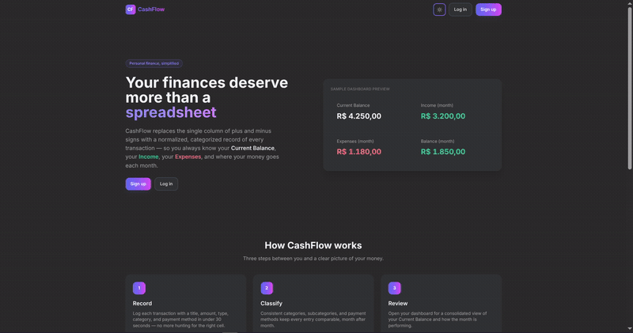

# CashFlow

A personal finance tracker built with Django full stack — record categorized transactions, project your balance forward from recurring and installment payments, and read it all back in a clean light/dark dashboard. Server-rendered, with no JavaScript build step.



## Why CashFlow exists

CashFlow was created by Henrique Mayer after struggling to manage personal
finances in generic spreadsheets. Those tools required too much adaptation and
still made it difficult to understand day-to-day cash flow, recurring expenses,
bank accounts, cards, and investments in one place.

The project turns that experience into a practical tool for other people facing
the same problem. Its focus is personal use, simple self-hosting, clear financial
information, and community collaboration — not becoming a SaaS platform or
optimizing prematurely for large-scale operation.

The source is publicly available so people can study it, adapt it, contribute to
it, and run their own noncommercial instance. Commercial use and resale are not
permitted by the project's license; see [License](#license).

## Features

- **Dashboard** with current balance, monthly income/expenses/investments, and a projected end-of-month balance
- **Forward projection** — fixed transactions recur and installment plans spread one payment per month, so future months preview without recording anything in advance
- **Filtered transaction history** — general search, separate billed-month and exact transaction-date filters, type filtering, and date/update/amount ordering
- **Reports** with server-rendered, zero-JS SVG charts for balance evolution, monthly cash flow, installments, cards and accounts, and expense categories
- **Categories and subcategories** with a per-user default seed on signup
- **Payment methods** with credit-card billing cycles (statement day and due day) and per-transaction bill overrides
- **Investments log** — a parallel universe to `Transaction` for tracking manual deposits, withdrawals, and yields, with settings to manage banks, brokers, investment products, free-form assets, and exchange rates. Automatic monthly and annual yield calculations are marked `Coming soon` (see [docs/apps/investments.md](docs/apps/investments.md))
- **Light/dark theme** toggle with a Darcula-inspired dark palette
- **Configurable currency** — pick BRL, USD, EUR, GBP, JPY, or CHF; the symbol and number format always match
- **English and Brazilian Portuguese UI** — selected from the public or authenticated navbar without changing URLs

## Stack

| | |
|---|---|
| Backend | Python 3.12 · Django 6.0 (CBVs, native auth) |
| Frontend | Django Template Language · TailwindCSS |
| Database | SQLite (native, no separate service) |
| Tooling | [`uv`](https://docs.astral.sh/uv/) |
| Deployment | Docker / Docker Compose · gunicorn · WhiteNoise |

## Quick start

Requires Python 3.12 and [`uv`](https://docs.astral.sh/uv/getting-started/installation/).

```bash
uv sync
uv run python manage.py migrate
uv run python manage.py runserver
```

Open <http://127.0.0.1:8000/>. Sign up from the landing page; your account arrives with the default categories seeded. Add a bank and a currency-specific account before recording your first transaction.

### Synthetic demo

Populate an English demo covering February through August 2026:

```bash
uv run python manage.py seed_demo
```

Login with `demo` / `DemoCashFlow2026!`. The dataset has exactly ten economic
events per month and exercises salary, fixed and variable expenses, installments,
PIX, debit and credit cards, invoices, own-account transfers, BRL/USD accounts,
exchange rates, points, investment deposits and partial withdrawals. To rebuild
only this account without affecting other users, run `seed_demo --reset`.

### Docker

Requires Docker with the Compose plugin.

```bash
cp .env.example .env        # then set a real SECRET_KEY
docker compose up --build
```

The container applies migrations and serves the app at <http://localhost:8000/>. Data persists in the `db-data` named volume across restarts; `docker compose down -v` resets it.

The image builds the production Tailwind bundle and runs `collectstatic` at build time, so nothing is generated on the fly in production. Release builds also need GNU gettext when regenerating the compiled translation catalog with `python manage.py compilemessages`.

## Choosing the interface language

The interface supports English (`en`) and Brazilian Portuguese (`pt-br`). Use
the language selector in the public navbar or, after login, in either the
desktop navbar or mobile menu. Django posts the choice to
`/i18n/set_language/` and stores it in its native language cookie; application
URLs remain stable and never gain a language prefix. On a first visit without
that cookie, `LocaleMiddleware` selects a supported language from the browser's
`Accept-Language` header and otherwise falls back to English.

Language selection also applies to HTMX responses because they pass through the
same middleware. It translates interface copy, validation and system messages,
not user-entered names or financial data: category names and other user data
remain exactly as entered.

## Using this repository as a template

This is a **GitHub template repository**. Click **Use this template** to start your own independent instance — each instance owns its own database and data, and is not meant to be deployed straight from here.

Unlike the usual Django convention, `db.sqlite3` is **tracked in version control** here, shipping with the schema migrated and the synthetic `demo` account described above. A fresh clone is runnable immediately. If you would rather follow the standard convention, untrack it before an instance holds real data:

```bash
git rm --cached db.sqlite3
echo 'db.sqlite3' >> .gitignore
```

## Choosing your currency

The app ships in Brazilian Real. Switch it with one setting — `CURRENCY` in `.env`, or an environment variable:

```bash
CURRENCY=USD uv run python manage.py runserver
```

| Code | Renders as | | Code | Renders as |
|---|---|---|---|---|
| `BRL` | `R$ 1.000,00` | | `GBP` | `£ 1,000.00` |
| `USD` | `$ 1,000.00` | | `JPY` | `¥ 1,000.00` |
| `EUR` | `€ 1.000,00` | | `CHF` | `CHF 1'000.00` |

One setting deliberately controls **both** the symbol and the number format — `$ 1.000,00` (dollar sign, Brazilian separators) would be wrong everywhere, so the two are defined together per currency in [`core/currencies.py`](core/currencies.py). An unsupported code raises `ImproperlyConfigured` at startup rather than mislabelling every amount. Interface language and currency are independent; matching `core/formats/en/` and `core/formats/pt_BR/` overrides preserve the selected currency's separators in either language.

## Project layout

```
core/          # Project configuration (settings, urls, wsgi, asgi)
pages/         # Public landing page
accounts/      # Sign up, login, logout (native auth)
dashboard/     # Aggregations, projections, and report charts
transactions/  # Transaction model + CRUD
categories/    # Category model + CRUD (self-related)
banking/       # Banks, accounts, cards, balances, invoices, points, and FX
investments/   # Investment log + manual ExchangeRate (multi-currency)
templates/     # Project-level Django templates
static/        # Project-level static assets
tailwind/      # Tailwind CSS source for the production build
```

## Configuration reference

Every variable in `.env.example` maps directly to `core/settings.py`:

| Variable | Purpose | Default if unset |
|---|---|---|
| `SECRET_KEY` | Django's cryptographic signing key | insecure development fallback — **required in production** |
| `DEBUG` | `True` / `False` | `True` |
| `ALLOWED_HOSTS` | Comma-separated hostnames | `localhost,127.0.0.1` |
| `SQLITE_PATH` | Absolute path to the SQLite file | `<project root>/db.sqlite3` |
| `CURRENCY` | Currency shown in the UI | `BRL` |
| `HTTPS` | Secure cookies, HTTPS redirect, HSTS | `False` |
| `LOG_LEVEL` | Log verbosity on stdout | `INFO` |

The app **refuses to start** when `DEBUG=False` and `SECRET_KEY` is unset, blank, still the placeholder from `.env.example`, or still the development fallback committed in `core/settings.py` — anyone holding a published key can forge session cookies. A fresh clone runs with no `.env` at all; the guard only applies once you turn `DEBUG` off.

Set `HTTPS=True` only once the instance is actually served over TLS — it sends session and CSRF cookies as `Secure`, redirects HTTP to HTTPS, emits HSTS, and trusts `X-Forwarded-Proto`. Over plain HTTP it would break login outright.

## Before you deploy

- Set a real `SECRET_KEY` and `DEBUG=False`.
- List your real domains in `ALLOWED_HOSTS`.
- Set `HTTPS=True` if served over TLS; confirm with `manage.py check --deploy`.
- Build the Tailwind bundle and run `python manage.py collectstatic --noinput` (the Docker image does both at build time).
- Keep `.env` out of version control, or use your platform's secret store.
- Start from an empty database if you are keeping `db.sqlite3` tracked.

## Documentation

- [`docs/ProductRequirementsDocument.md`](docs/ProductRequirementsDocument.md) — full product specification and requirements
- [`docs/`](docs/README.md) — technical reference for every app, model, view, and template
- [`ROADMAP.md`](ROADMAP.md) — prioritized implementation and UX improvement plan

## License

Copyright (c) 2026 Henrique Mayer

Licensed under the [PolyForm Noncommercial License 1.0.0](https://polyformproject.org/licenses/noncommercial/1.0.0). Personal, noncommercial use is permitted — including using this repository as a template for your own personal, local instance; selling this software, or using it for any commercial purpose, is not. See [LICENSE](LICENSE) for the full terms.

Copies and modified distributions must preserve the license terms and the
required copyright notice. Public source code cannot be made technically
impossible to copy; the copyright and license define which uses are permitted.
