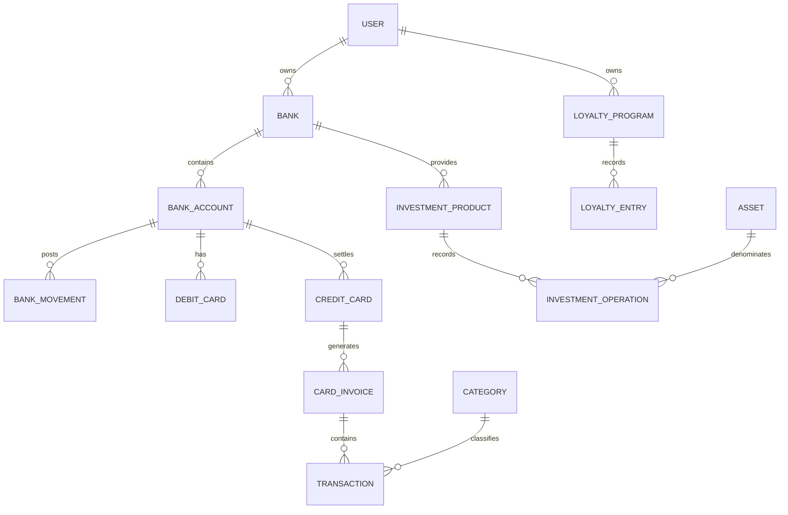
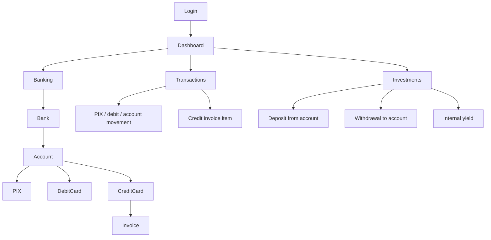

# PRD — CashFlow Banking and Multicurrency Update

**Status:** Approved

**Release type:** Breaking, clean migration reset
**Product:** Django personal finance tracker

## 1. Overview

CashFlow replaces generic payment methods with an explicit banking model. The
release adds banks, currency-specific accounts, an authoritative movement
ledger, PIX, debit and credit cards, card invoices and loyalty points.
Per-user multicurrency preferences and retained historical conversion evidence
are implemented in Phases 3–4. Investments remain separate while sharing banks and
bank accounts for providers and cash settlement.

The product remains a lean Django full-stack application: native authentication,
SQLite, Django Template Language, TailwindCSS, server-rendered charts and narrow
HTMX progressive enhancement.

## 2. Goals

| # | Goal | Expected result |
|---|---|---|
| G1 | Make account balances auditable | Every balance derives from opening balance plus posted movements. |
| G2 | Model settlement correctly | PIX/debit settle immediately; credit settles through invoices. |
| G3 | Eliminate double counting | Credit spending and invoice payment affect different reporting components. |
| G4 | Multicurrency roadmap | Preserve currency-specific account data; per-user reporting and historical FX evidence are implemented in Phases 3–4. |
| G5 | Connect cash and investments safely | Required bank source/destination without merging the ledgers. |
| G6 | Track loyalty value and cost | Editable points entries and complete redemption/IOF details. |

## 3. Scope

### In scope

- Maintain the banking schema without automatic legacy-data conversion.
- `Bank` with multiple `BankAccount` rows, each in one currency.
- Account opening balance and derived `BankMovement` ledger.
- PIX enabled as a standard account capability by default.
- Debit and credit cards linked to a bank account.
- Card invoices, invoice items and due-date account settlement.
- Ordinary external PIX income/expense and neutral own-account transfers.
- Independent or bank/card-linked loyalty programs and points ledger.
- Currency-specific bank accounts and manual exchange rates.
- Investment products, classified assets, quantity/unit-price operations and
  mandatory bank cash endpoints.
- Dashboard/read models updated for cash, invoices, investments and net worth.

### Out of scope

- Automatic migration of legacy financial rows.
- Open Finance/bank synchronization, statement imports and issuer APIs.
- Market-price, FX or loyalty-provider feeds; rates and valuations remain manual.
- Collaborative accounts, accounting-grade general ledger and tax reporting.
- A SPA, JavaScript charting library or Node/npm frontend pipeline.

## 4. Functional Requirements

| # | Requirement | Description |
|---|---|---|
| FR01 | Authentication and isolation | Native Django auth; every financial object and relationship is user-scoped. |
| FR02 | Banks | CRUD for `Bank`, shared by banking, loyalty and investments. |
| FR02A | Base currency | Each user has a base reporting currency, initialized from the project default and independently editable. |
| FR03 | Bank accounts | A bank owns many accounts. Each account has name, currency, opening balance and PIX capability enabled by default. |
| FR04 | Account ledger | Available balance equals opening balance plus signed effective `BankMovement` rows. Derived rows are synchronized when their source record changes. |
| FR05 | PIX and debit | External PIX and debit-card events create categorized transactions and immediate account movements. |
| FR06 | Cards | Debit and credit cards are linked to one bank account; only credit cards have statement/invoice rules. |
| FR07 | Credit invoices | Credit purchases enter a `CardInvoice` and do not reduce account cash on purchase date. The account is debited once on invoice due date. |
| FR08 | No double counting | Spending is recognized from invoice items; invoice settlement changes cash/liability and is not a second expense. |
| FR09 | Own transfers | Transfers between owned accounts create linked debit/credit movements and are never income or expense. |
| FR10 | External PIX | PIX involving an external party is an ordinary `INCOME` or `EXPENSE`, not an own transfer. |
| FR11 | Transactions | CRUD/search/filter for income and expense events, with category, amount, date, recurrence and banking settlement links. The entry form progressively reveals the selected payment channel while retaining server-rendered no-JavaScript controls and validation. |
| FR12 | Categories | Existing category/subcategory management remains for income and expense. |
| FR13 | Loyalty programs | A program may be independent, linked to a bank, linked to cards, or linked to both. |
| FR14 | Loyalty ledger | `LoyaltyEntry` supports invoice award, points purchase, adjustment, expiration and redemption. |
| FR15 | Redemption details | Redemption records points, target monetary amount/currency, IOF, and IOF funding instrument. Positive IOF requires an owned account, debit card or credit card. |
| FR16 | Multicurrency | Each user selects a supported reporting currency in Settings; native amounts and currencies remain unchanged. |
| FR17 | Historical FX | Retain source/target currencies, applied rate, effective date, and conversion status so later rate edits cannot rewrite history. |
| FR18 | Investments structure | Investments remain separate, use `Bank` instead of `Institution`, and group products and assets by bank/product/asset. |
| FR19 | Assets | Every asset has name, code, asset class and currency; class/currency are immutable after use. |
| FR20 | Investment operations | Every operation records kind, quantity and unit price and has no title. Gross value is derived. |
| FR21 | Investment cash endpoints | Deposit requires a source bank account; withdrawal requires a destination bank account. Their movements post atomically with the operation. |
| FR22 | Internal yield | Yield changes the investment position only and creates no bank income/movement until withdrawn. |
| FR23 | Dashboard | Show account cash, income, expenses, card payable, investment value and net worth using the user's base currency, with historical snapshots and clearly labeled current valuations. |
| FR24 | Forecasts | Recurrences and future invoices may be projected but do not alter the posted ledger before settlement. |
| FR25 | Breaking delivery | Use a clean migration reset with no compatibility or automatic legacy import. |
| FR26 | Interface language | English and Brazilian Portuguese are selectable without localized URL prefixes; the selection persists in Django's language cookie and is independent of currency. |
| FR27 | Clean account bootstrap | A newly created account receives only the approved top-level categories; the repository ships no synthetic financial dataset, shared account, or fixed credential. |
| FR28 | Local database ownership | The current tree and future commits do not track `db.sqlite3`; migrations create each installation's database, whose owner is responsible for protection and backup. Historical Git objects require separate coordinated cleanup. |

## 5. Domain Rules

### Current implementation status

CashFlow currently supports editable personal records. Each user has a
`accounts.UserPreference` row with a base reporting currency. New and existing
users default to BRL; changing the preference affects consolidated display only
and does not mutate native financial records. Cross-currency transfers and
investment operations persist an FX snapshot, while current/manual rates are
reserved for explicitly labeled current-value simulations elsewhere.

### 5.1 Balance and settlement

- Amounts are positive; direction/kind carries the sign.
- Account balance is never calculated from transaction totals.
- PIX, debit card and direct account events settle immediately.
- Credit purchases affect expense reporting and card payable, not available cash.
- Invoice payment creates one account debit on `due_date` and clears/reduces the
  payable. It does not create expense again.
- Personal financial rows remain editable and deletable by their owner.

### 5.2 Transfer classification

- Source and destination both owned by the user means own transfer.
- An own transfer has two linked movements, is category-neutral and is excluded
  from income/expense and consolidated net cash flow.
- Different currencies retain source and destination amounts plus the applied
  FX snapshot when conversion is available. Missing conversion remains an
  explicit incomplete status.
- PIX alone does not imply transfer. An external PIX is normal income/expense.

### 5.3 Loyalty

- Points balance is the signed sum of `LoyaltyEntry` rows.
- Invoice awards may reference the eligible invoice.
- Purchase, adjustment, expiration and redemption remain distinguishable.
- A redemption carries points, target money amount/currency, IOF amount and IOF
  funding instrument. IOF settlement follows that instrument's normal rule:
  account/debit immediately, credit through an invoice.

### 5.4 Currency

- `UserPreference.base_currency` selects each user's reporting currency.
- The preference is created automatically at signup and backfilled safely for
  existing users with the code-level BRL default.
- Switching currency recalculates presentation totals only; native amounts are
  never converted or relabeled.
- Cross-currency transfers and investment operations persist source/target
  currencies, rate value, effective date, and status. Existing rows are
  reconstructed only when an authoritative rate provides evidence; otherwise
  native values remain intact and conversion is marked incomplete. Editing an
  event's amount, currency, or date refreshes its snapshot; descriptive edits do
  not. Other entities remain on live/current conversion for now.

### 5.6 Public registration

- A single `ALLOW_SIGNUPS` environment setting controls whether the public
  signup route may create new native Django users; it defaults to `True` for an
  open local/community instance.
- When disabled, direct requests return a localized explanation and persist no
  user. Login and all existing accounts remain unchanged.
- Public navigation reflects the same setting, but authorization is enforced in
  the server-side signup view rather than by link visibility alone.

### 5.5 Investments

- The investment position ledger and categorized transaction ledger stay
  separate.
- `Bank` replaces `Institution` as investment product provider.
- Quantity and unit price are stored; operation title is removed.
- Deposit/withdrawal cash movements are not income/expense.
- Deposit source and withdrawal destination are mandatory.
- Yield is internal and creates no account movement.

## 6. Data Structure



Detailed fields, constraints and formulas are normative in
[data-model.md](data-model.md).

## 7. App Organization

```text
core/          # configuration, currency and formatting
pages/         # public site
accounts/      # authentication
categories/    # category hierarchy
banking/       # banks, accounts, ledger, PIX, cards, invoices, loyalty, FX
transactions/  # economic events and recurrence
dashboard/     # read models and reports
investments/   # products, assets, position operations and valuation
```

Navigation and financial relationships use the current banking concepts.

## 8. UX Flows



Banking setup leads with bank and account creation. PIX requires no separate
payment-method record because it is an account capability. Transaction forms
show only instruments compatible with the selected account/currency and owned by
the logged-in user.

## 9. Dashboard and Reports

The dashboard separates cash, economic activity, liabilities and positions:

| Component | Source |
|---|---|
| Available cash | Opening balances + posted bank movements. |
| Income/expense | Categorized transactions; no transfers/investment cash legs. |
| Card payable | Open invoice item totals less payments. |
| Investment value | Investment quantities and historical/current valuation. |
| Net worth | Converted cash + investments - card payable. |

Reports remain responsive, server-rendered SVG/CSS. HTMX may swap chart islands,
but all filters and navigation retain plain GET fallbacks. Every total states its
currency/valuation date and whether it is actual or projected.

## 10. Frontend Requirements

- Preserve the current light/dark design language, semantic colors, typography,
  reusable partials and mobile-first behavior.
- Keep banking as the navigation and settlement domain.
- Banking screens expose hierarchy without hiding accounting consequences:
  bank, accounts/currencies/balances, capabilities/cards, ledger and invoices.
- Credit transaction forms explain that cash moves at invoice payment; debit and
  PIX forms explain immediate settlement.
- Own transfers use a neutral visual treatment.
- Native and base amounts are never shown without currency codes/symbols.
- Missing FX, overdue invoices and incomplete totals receive explicit
  accessible status text, not color-only signaling.
- The public navbar and authenticated desktop/mobile navbars expose the same
  English/Brazilian Portuguese selector. The initial visit may use the browser
  language; subsequent requests use the native Django language cookie.
- Interface labels and system messages are translated. Categories and all other
  user-entered or persisted domain data are displayed verbatim, not translated
  automatically.

## 11. Non-Functional Requirements

| # | Requirement | Description |
|---|---|---|
| NFR01 | Atomicity | Multi-row posting workflows run in one database transaction. |
| NFR02 | Idempotency | Invoice settlement and scheduled posting cannot duplicate movements. |
| NFR03 | Editability | Personal records may be corrected by their owner; audit-grade reversals are out of scope. |
| NFR04 | Isolation | Querysets, forms and services validate user ownership. |
| NFR05 | Precision | Decimal arithmetic only; explicit currency and rounding policy. |
| NFR06 | Performance | Use scoped querysets, `select_related`/`prefetch_related`, and bounded read-model folds. |
| NFR07 | Accessibility | Responsive keyboard-usable server-rendered UI and text status labels. |
| NFR08 | Simplicity | Native Django patterns; no API/SPA introduced by this release. |

## 12. Acceptance Criteria

- [ ] One bank can hold multiple accounts with independent currencies/opening balances.
- [ ] Account balance exactly reconciles to opening balance plus movements.
- [ ] PIX capability defaults on; an external PIX posts normal income/expense immediately.
- [ ] Debit posts immediately; credit purchase enters an invoice without cash debit.
- [ ] Invoice due-date settlement debits the account once and does not duplicate expense.
- [ ] Own transfers create paired movements and never affect income/expense.
- [ ] Historical base totals remain unchanged after a newer FX rate is added.
- [ ] Loyalty supports all five entry kinds and complete redemption/IOF funding data.
- [ ] Investments use `Bank`, classified/currency assets and quantity/unit price, with no title.
- [ ] Investment deposit source and withdrawal destination are required; yield is internal.
- [ ] Dashboard reconciles cash, card payable, investments and net worth without double count.
- [ ] Mobile and desktop banking/investment flows preserve no-JS fallbacks.
- [ ] English and Brazilian Portuguese work on full pages and HTMX fragments,
      retain stable URLs, and do not alter currency separators or user data.
- [ ] Fresh migrations install successfully on an empty SQLite database.
- [ ] The root SQLite database is ignored by Git and a clean clone becomes usable after migrations.
- [ ] Legacy database use is blocked/documented; no partial in-place migration is implied.

## 13. Delivery Plan

1. Remove legacy migration artifacts and databases from the release workspace.
2. Add `banking` models and services in dependency order: bank/account/rates,
   movements/transfers, cards/invoices, loyalty.
3. Rebuild transactions against banking settlement paths.
4. Rebuild investments against `Bank`, accounts, classified assets and quantity pricing.
5. Rebuild dashboard read models and reports from the new sources of truth.
6. Replace navigation/templates and verify responsive/no-JS behavior.
7. Generate fresh migrations, migrate an empty database, seed only approved defaults,
   and run reconciliation/isolation/regression tests.

## 14. Breaking Release Procedure

This release intentionally has no in-place schema migration. Before deployment,
operators may export legacy data for manual reference. Deployment then uses a
fresh SQLite database and newly generated initial migrations. Legacy data shapes
are unsupported. Rollback requires restoring the entire pre-release application
and its matching database backup; mixing old and new code/database versions is
not supported.
