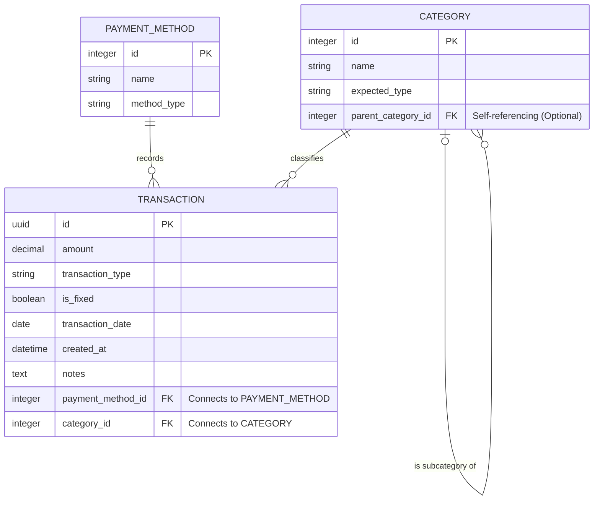

# Pre-Product Requirements Document (Pre-PRD)
## Project: Django Personal Finance Tracker

### 1. Overview
A web-based personal finance tracking application designed to give a clear view of cash flow, recurring expenses, and categorization of daily transactions. The project prioritizes a clean, standard financial vocabulary and a robust relational database structure.

### 2. Tech Stack & Environment
*   **Backend Framework:** Django (Python)
*   **Frontend UI/UX:** Django Templates with TailwindCSS
*   **Database:** SQLite (Django native)
*   **Environment:** Configured for cross-platform development (Linux Pop!_OS/Debian and Windows), optimized for PyCharm.

### 3. Repository Strategy
The project is split into two repositories to isolate the core codebase from personal, trackable data:
*   `django-finance-template`: The core application, boilerplate, and UI. The `.gitignore` explicitly ignores `db.sqlite3` to keep the repo clean and public-ready.
*   `cashflow-live`: The personal, live instance where `db.sqlite3` is tracked, acting as a portable "vault" for real financial data.

### 4. Database Architecture (ERD Summary)
The system moves away from spreadsheet-style data entry (+/- signs in one column) to a normalized relational database.

#### 4.1 Models
*   **Transaction:** 
    *   `amount` (Decimal, always absolute/positive)
    *   `transaction_type` (Enum: Income, Expense, Investment)
    *   `is_fixed` (Boolean: True for recurring bills, False for variable)
    *   `transaction_date` (Date, user-editable)
    *   `created_at` (DateTime, system-generated, immutable)
    *   `title` (Short name, e.g., "Dinner")
    *   `notes` (Optional long text)
    *   `payment_method_id` (Foreign Key)
    *   `category_id` (Foreign Key)
*   **PaymentMethod (formerly "Tags"):**
    *   `name` (e.g., "Nubank Credit", "PIX", "Checking Account")
    *   `method_type` (Credit Card, Debit Card, Checking Account, etc.)
*   **Category:**
    *   `name` (e.g., Transportation, Food, Pets, Fitness)
    *   `parent_category_id` (Self-referencing Foreign Key for subcategories, e.g., "Uber" belonging to "Transportation")

### 5. Terminology & Standardizations
Key English financial terms established for the codebase and UI:
*   **Current Balance:** The total available money across accounts at this exact moment.
*   **Net Income:** The performance of a specific period (Income - Expenses for the current month).
*   **Transportation:** The correct umbrella term for mobility/displacement (Subcategories: Ride-sharing, Public Transit, Parking).
*   **Groceries:** Used for supermarket expenditures.
*   **Subscriptions:** Used for recurring services (Netflix, JetBrains, Meli+).

### 6. UI/UX Flow Corrections
*   **Dashboard:** Highlights `Current Balance`, `Income (current month)`, `Expenses (current month)`, and `Net Income (current month)`.
*   **New Transaction Form:** Must include all required database fields: Title, Amount, Transaction Type, Category, Payment Method, Date, and the `is_fixed` toggle. Individual transactions do not calculate a "Net Income".

### Mermaid
