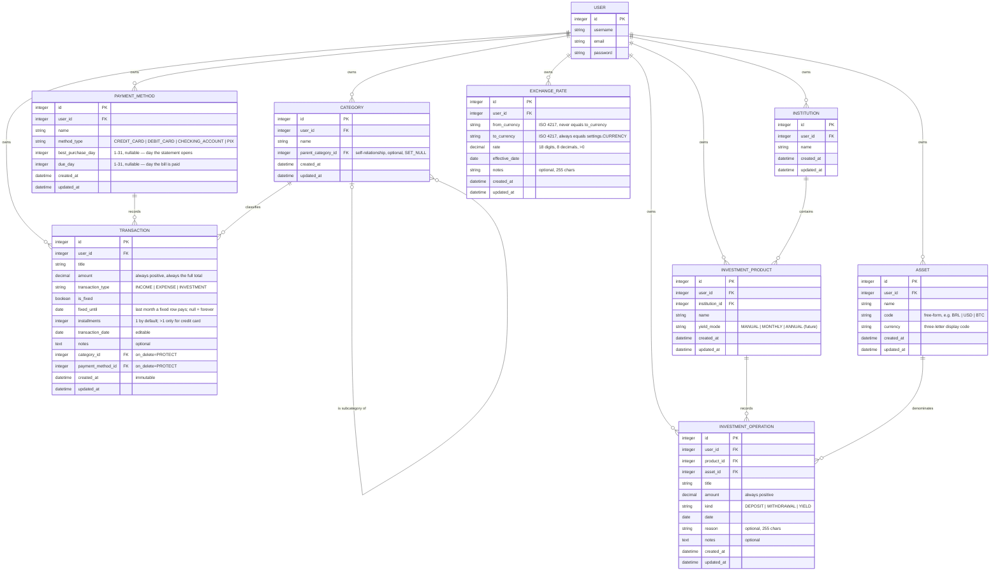

# Data Model

The four models, their fields, and the business rules that govern them (PRD §8.3–§8.5). Per-app CRUD/view behavior is documented in [`apps/`](apps/); this page is the single source of truth for *what the data means*.

## Entity-relationship diagram



`USER` is Django's stock `django.contrib.auth.models.User` — there is no custom user model anywhere in this project.

## Models

### `User` (Django native)

Not defined in this codebase — used as-is from `django.contrib.auth`. Referenced everywhere as `settings.AUTH_USER_MODEL`.

### `Category` (`categories/models.py`)

| Field | Type | Notes |
|---|---|---|
| `user` | FK → `AUTH_USER_MODEL` | `on_delete=CASCADE`, `related_name='categories'` |
| `name` | `CharField(max_length=100)` | |
| `parent_category` | FK → `self` | `on_delete=SET_NULL`, `null=True, blank=True`, `related_name='subcategories'` |
| `created_at` | `DateTimeField(auto_now_add=True)` | immutable |
| `updated_at` | `DateTimeField(auto_now=True)` | |

- `Meta.ordering = ['name']`.
- `Meta.constraints`: `UniqueConstraint(user, name)` named `unique_category_per_user` — the same category name can exist for two different users, never twice for the same user.
- `__str__`: `"{parent} > {name}"` for a subcategory, otherwise just `name`.
- A category with no `parent_category` is top-level; one with a `parent_category` is a subcategory (e.g. `Uber` → `Transportation`). This is a single self-relationship, not a full arbitrary-depth tree — a subcategory's own `parent_category` field is not further restricted by depth, but the UI/forms only ever expose one level (`CategoryForm` excludes the instance itself from its own parent choices, preventing a category from becoming its own parent — it does not prevent longer chains).
- If a parent category is deleted, its subcategories are **not** deleted — `parent_category` is set to `NULL` (`SET_NULL`), demoting them to top-level categories. This differs from the `PROTECT` behavior on `Transaction.category` below.

### `PaymentMethod` (`payments/models.py`)

| Field | Type | Notes |
|---|---|---|
| `user` | FK → `AUTH_USER_MODEL` | `on_delete=CASCADE`, `related_name='payment_methods'` |
| `name` | `CharField(max_length=100)` | free-form label, e.g. "Nubank Credit" |
| `method_type` | `CharField(choices=MethodType)` | see enum below |
| `best_purchase_day` | `PositiveSmallIntegerField(null=True, blank=True)` | `MinValueValidator(1)` + `MaxValueValidator(31)` — day the statement opens; credit card only |
| `due_day` | `PositiveSmallIntegerField(null=True, blank=True)` | `MinValueValidator(1)` + `MaxValueValidator(31)` — day the bill is paid; credit card only; display-only, shifts nothing |
| `created_at` | `DateTimeField(auto_now_add=True)` | |
| `updated_at` | `DateTimeField(auto_now=True)` | |

- `Meta.ordering = ['name']`.
- `Meta.constraints`: `UniqueConstraint(user, name)` named `unique_payment_method_per_user`.
- `__str__`: `"{name} ({method_type display})"`, e.g. `"Nubank Credit (Credit Card)"` — **except** when the name already *is* the type label (case- and whitespace-insensitive), where it returns just the name. A user is free to name a method after its own type ("Credit Card", "PIX"), so the unconditional form would render `"Credit Card (Credit Card)"` in every dropdown; the case-fold check keeps that one clean.
- `has_billing_cycle` (property): `method_type == CREDIT_CARD` **and** `best_purchase_day` set. `due_day` is not part of it — it moves no money. `PaymentMethodForm.clean()` rejects either field on a non-credit-card method.
- `statement_offset(purchase_date)` (method): whole months from a purchase to the month it comes off the balance — `0` or `1`, and `0` without a cycle. See [Billing cycle](#billing-cycle-when-a-card-purchase-actually-leaves-the-account) below.
- `due_date_in(year, month)` (method): the due day clamped to that month's length, so a due day of 31 still resolves in February. `None` when the card records no due day.

### `Transaction` (`transactions/models.py`)

| Field | Type | Notes |
|---|---|---|
| `user` | FK → `AUTH_USER_MODEL` | `on_delete=CASCADE`, `related_name='transactions'` |
| `title` | `CharField(max_length=150)` | |
| `amount` | `DecimalField(max_digits=10, decimal_places=2)` | `MinValueValidator(Decimal('0.01'))` — always positive, always the **full total** |
| `transaction_type` | `CharField(choices=TransactionType)` | see enum below |
| `category` | FK → `Category` | `on_delete=PROTECT`, `related_name='transactions'` |
| `payment_method` | FK → `PaymentMethod` | `on_delete=PROTECT`, `related_name='transactions'` |
| `installments` | `PositiveSmallIntegerField(default=1)` | `MinValueValidator(1)` + `MaxValueValidator(Transaction.MAX_INSTALLMENTS)` (48) — credit card only, see below |
| `is_fixed` | `BooleanField(default=False)` | recurring vs. variable |
| `fixed_until` | `DateField(null=True, blank=True)` | last month a fixed transaction pays, inclusive; null = open-ended |
| `transaction_date` | `DateField` | the only user-editable date |
| `notes` | `TextField(blank=True)` | optional |
| `created_at` | `DateTimeField(auto_now_add=True)` | immutable, system-generated |
| `updated_at` | `DateTimeField(auto_now=True)` | |

- `Meta.ordering = ['-transaction_date', '-created_at']` — newest transaction date first, ties broken by creation order.
- `__str__`: `"{title} ({transaction_type display})"`.
- `MAX_INSTALLMENTS = 48` — a class constant, referenced by the model validator, the form widget's `max` attribute, and the help text, so the ceiling is defined in exactly one place.
- `is_installment_plan` (property): `installments > 1`.
- `installment_amount` (property): `amount / installments`, quantized to 2 decimal places with `ROUND_HALF_UP`. **Presentation-only** — the rounded parts may not re-sum to `amount` to the cent (e.g. `100.00 / 3` → `33.33` ×3 = `99.99`), so no balance calculation ever derives from it.
- `calendar_months_to(year, month)` (method): raw month distance from `transaction_date`, with no billing cycle applied — the distance between two dates the user typed.
- `billing_offset` (property): `payment_method.statement_offset(transaction_date)`, i.e. how many months later than the purchase the money leaves. `0` for everything except a credit card with a cycle.
- `months_from_start(year, month)` (method): `calendar_months_to(...) − billing_offset`. **The origin is the month the payment clears, not the month of the purchase** — this single subtraction is what moves every downstream figure onto the billing month.
- `last_fixed_offset` (property): how many months after the start the fixed recurrence last pays, or `None` when open-ended. Measured on `calendar_months_to`, **not** `months_from_start`: `transaction_date` and `fixed_until` both describe the charge, so a billing cycle moves the whole run of payments later without adding or removing any. Clamped at `0`, so a `fixed_until` before the start month pays once rather than a negative number of times.
- `billed_month` (property): first day of the month this comes off the balance — the month `months_from_start` counts from, and the **first** one for a recurrence. Display only; `None` when the arithmetic runs off the end of the calendar, which `months_from_start` (plain integers) does not care about.
- `payment_date` (property): the exact day the money leaves — the purchase date without a cycle, otherwise the card's due day inside `billed_month`, so the two can never name different months. `None` when the card records no `due_day`; callers fall back to `billed_month`.

## Enums

```python
# transactions/models.py — Transaction.TransactionType
INCOME = 'INCOME', 'Income'
EXPENSE = 'EXPENSE', 'Expense'
INVESTMENT = 'INVESTMENT', 'Investment'
```

```python
# payments/models.py — PaymentMethod.MethodType
CREDIT_CARD = 'CREDIT_CARD', 'Credit Card'
DEBIT_CARD = 'DEBIT_CARD', 'Debit Card'
CHECKING_ACCOUNT = 'CHECKING_ACCOUNT', 'Checking Account'
PIX = 'PIX', 'PIX'
```

Both are `models.TextChoices` — the first value is what's stored in the database, the second is the human-readable label (`get_<field>_display()`).

## Business rules

### Amount is always positive

`amount` is validated with `MinValueValidator(Decimal('0.01'))` at the model layer — a zero or negative amount never reaches the database. Whether a transaction increases or decreases a balance is derived **entirely** from `transaction_type`; the stored number never carries a sign. This is why every balance calculation below is written as an explicit `+`/`−` per type rather than a single `Sum(amount)`.

### Balance formulas

Computed in `dashboard/services.py::get_dashboard_summary()`, PRD §8.5. Every "Σ" below sums **monthly contributions** (see Recurrence, next section), not raw `amount` values — a fixed transaction counts once per elapsed month, an installment plan once per installment:

- **Current Balance** = Σ Income − Σ Expenses − Σ Investments, for everything realized **through today's month**.
- **Balance (month)** = the selected month's Income − Expenses − Investments, scoped via `transaction_date` (never `created_at`). The selected month defaults to the current one and may be in the future.
- **Projected Balance** = Current Balance rolled forward to the end of the selected month; equal to Current Balance when the selected month *is* the current month.

> **Decision (2026-07-24):** Investment is defined as a cash outflow, so it is subtracted from *both* balances above — otherwise Current Balance would overstate the money actually available. Investment is **never merged into the Expenses indicator**; the dashboard shows it as a separate stat card (`investment_month`) precisely so the user can see where that money went without it inflating "Expenses". If this rule is ever revisited (e.g. treating Balance (month) as consumption-only, Income − Expenses), `get_dashboard_summary()` is the single place that encodes it.

### Recurrence: when a transaction hits a month

This is the single most important rule in the data model, because it is what makes the dashboard a **forecast** rather than a report. `transaction_date` marks where a transaction *starts*, not the only month it affects. `Transaction.amount_for_month(year, month)` is the authority:

| Shape | Condition | Contributes |
|---|---|---|
| Fixed | `is_fixed=True` | `amount`, in **every** month from its start month through `fixed_until` (inclusive) — indefinitely when `fixed_until` is empty |
| Installment plan | `installments > 1` | one installment per month, for `installments` consecutive months |
| One-off | neither | `amount`, in its start month only |

"Start month" is the month the payment clears, which is the purchase month for every method **except** a credit card with a billing cycle — see [Billing cycle](#billing-cycle-when-a-card-purchase-actually-leaves-the-account) below. The three shapes are mutually exclusive: `TransactionForm.clean()` rejects `is_fixed` together with `installments > 1`, because "repeats forever" and "ends after N months" are contradictory recurrences and a silent precedence rule would make the projection unexplainable.

Nothing is materialized. There are **no** future-dated child rows and no scheduler — future months are computed on read from the transactions that already exist. That is exactly what makes editing work the way you would expect: change a fixed salary's `amount` and every month it covers re-projects immediately, with no backfill and no rows to clean up. Note the scope of "every month it covers" — see the next subsection.

#### Ending a fixed transaction without losing history (FR18)

`fixed_until` is the answer to "my salary changed — how do I keep the old months correct?"

A fixed transaction stores **one** amount, and that amount applies to every month it covers. So editing it does not just change the future: it rewrites the past too. Raise a 2000 salary to 3000 by editing the row, and January retroactively becomes 3000 — the history is gone, because there was only ever one number.

The fix is not to version the row, it is to **end it**:

| Row | Amount | Starts | `fixed_until` |
|---|---|---|---|
| Salary | 2000 | Jan | **May** |
| Salary | 3000 | Jun | *(empty)* |

January–May report 2000, June onward reports 3000, no month is double-counted at the handover, and both rows stay individually editable.

Two consequences worth stating plainly:

- **Editing a fixed transaction's amount is only correct when the amount was always that value** (fixing a typo). For a genuine change of value from a point in time, end the old row and add a new one.
- `fixed_until` is compared **by month**, not by day — recurrence is monthly, so the 1st and the 28th of the same month mean the same thing. `TransactionForm` enforces that `fixed_until` requires `is_fixed` and cannot fall before the starting month, but same-month is allowed (that is a single payment).

`amount_through_month(year, month)` is the cumulative counterpart (everything contributed from the start through that month), computed in constant time rather than by looping months. The running balances use it.

### Installments (credit card only)

`installments` records how many times a purchase was split. Four rules define it:

1. **`amount` is always the full total, never the value of one installment.** A 3× purchase of R$ 300.00 stores `amount=300.00, installments=3`; the R$ 100.00 monthly value is derived by `installment_amount`. Storing the total keeps the transaction list honest about what was actually bought, and keeps one row per purchase.
2. **The cost is spread one installment per month**, starting in the month the first installment is *paid* — see the recurrence table above. On a card with no billing cycle that is the purchase's own month: a 3× purchase in January costs 100 in January, 100 in February, 100 in March, and nothing afterwards. With a cycle, the whole run starts on the first bill instead.
3. **`installments > 1` is only valid when the payment method's `method_type` is `CREDIT_CARD`.** Enforced server-side in `TransactionForm.clean()` (`transactions/forms.py`) — not in the model, because the rule spans two fields and only applies to user-submitted data.
4. **Blank means 1.** The form field is `required = False`; `clean_installments()` turns a missing value into `1`. An explicit `0` is *not* defaulted — it falls through to the model's `MinValueValidator(1)` and is rejected, so a bad value can never be silently rewritten into a valid one.

**Rounding never loses money.** `installment_amount` rounds to the cent, so R$ 100.00 in 3× gives 33.33 — three of which is 99.99. `amount_for_month` gives the remainder to the **final** installment (33.33, 33.33, **33.34**), so the occurrences always re-sum to exactly `amount`.

> **Scope note:** this models an installment *purchase*, not a credit-card *statement*. `installments` is a property of the purchase; which month each installment falls in is decided by the card, in the next section.

### Billing cycle: when a card purchase actually leaves the account

A credit card does not take the money when you buy something — it takes it on the bill the purchase lands on, which for a purchase made after the statement opens is the following month. Without that, a purchase made on the 26th showed up in the same month's balance even though the account is not touched until the next bill, and the forecast for the current month was wrong by however much was spent after the statement closed.

Two optional fields on `PaymentMethod` describe the cycle, and only the first of them moves money:

| Field | Meaning |
|---|---|
| `best_purchase_day` | the day the new statement **opens**. Buying on this day or later puts the charge on the *next* month's bill — which is precisely what makes it the "best" day to buy. **This field alone decides which month a purchase is subtracted from.** |
| `due_day` | the day of that month the bill is **paid**. A reminder, shown on the payment method list; it never changes which month a purchase falls in. |

`statement_offset(purchase_date)` is therefore a single shift:

- `purchase_date.day >= best_purchase_day` → `+1` month, otherwise `0`.

Worked example, a card opening on the **24th**:

| Purchase | Comes off the balance in | Offset |
|---|---|---|
| Pillow, 20 June | **June** | 0 |
| Toy, 25 June | **July** | +1 |
| Toy, 25 July | **August** | +1 |

Two purchases five days apart, one month apart on the balance.

> **Why `due_day` is deliberately inert.** An earlier version added a second `+1` when `due_day < best_purchase_day`, on the reasoning that a bill due on the 4th cannot be paid in a month whose statement closes on the 24th. It is defensible in cash-flow terms and it was wrong for this app: on a 24/04 card it pushed a 25 July purchase all the way out to September, when what the user wants to see is the purchase landing on the next month's bill. The month is the unit the dashboard works in, so the opening day decides it and the due day only labels the day within it.

Rules that fall out of this:

- **The opening day is enough.** `has_billing_cycle` requires only `best_purchase_day`; either field may be filled in without the other. A card with just a due day shifts nothing and simply displays the reminder.
- **Credit cards only.** Debit, PIX and a checking account take the money on the purchase date; there is no statement for a purchase to fall on the far side of. The form rejects the fields on those types (it cannot hide them: the project is zero-JS, so they cannot appear and disappear as `method_type` changes).
- **No cycle means no shift.** Both fields default to `NULL`, so existing data and any card whose dates the user has not filled in behave exactly as they did before the feature existed.
- **Short months are clamped.** A cycle opening on the 31st still opens in February — `min(best_purchase_day, days_in_month)` — and a due day of 31 resolves to the 28th/30th via `due_date_in()`.
- **The offset moves a recurrence, it does not resize it.** A fixed transaction charged January–June is six payments on any card; the cycle only decides which six months the money leaves in. That is why `last_fixed_offset` measures the calendar distance from `transaction_date` to `fixed_until` rather than going through `months_from_start`.
- **`transaction_date` stays the purchase date.** It is what the user actually knows and what the transaction list shows; the month the money actually leaves is derived from the billing cycle and is what the dashboard and the list's `Billed month` filter operate on.

### Date semantics

- `created_at` — system-generated on insert, immutable, never shown as "the" transaction date.
- `transaction_date` — the only user-editable date, and the one every monthly aggregation filters on.

### Deletion integrity

- `Transaction.category` and `Transaction.payment_method` use `on_delete=PROTECT`: deleting a `Category` or `PaymentMethod` that is still referenced by at least one `Transaction` raises `django.db.models.ProtectedError` instead of cascading. Both `CategoryDeleteView` and `PaymentMethodDeleteView` catch this exception and turn it into a friendly `messages.error(...)` instead of a 500 — see [apps/categories.md](apps/categories.md#deletion) and [apps/payments.md](apps/payments.md#deletion).
- `Transaction.user`, `Category.user`, `PaymentMethod.user` all use `on_delete=CASCADE` — deleting a Django `User` deletes all of their data. There is no soft-delete or archival in this project.
- `Category.parent_category` uses `on_delete=SET_NULL` — deleting a parent category demotes its children to top-level rather than blocking the deletion or cascading.

### Uniqueness

`Category` and `PaymentMethod` names are unique **per user** (`UniqueConstraint(user, name)`), enforced at the database layer. Two different users can both have a category named `Groceries` (in fact, every user does — see default-data seeding below); the same user cannot have two.

### Per-user isolation

Every model has a mandatory `user` FK, and every view that touches these models filters by `request.user` in `get_queryset()`. There is no code path in the project that returns cross-user data — see [architecture.md § Request flow](architecture.md#request-flow-a-typical-authenticated-screen) for how this is enforced consistently across CBVs.

### Default data seeding (FR14)

A brand-new user cannot create a transaction without at least one `Category` (a required FK). To avoid a dead-end first-run experience, a single `post_save` signal on `User` (`created=True` only) seeds:

- 9 default top-level categories (`categories/signals.py`) — see [apps/categories.md](apps/categories.md#default-category-seeding-fr14).

`PaymentMethod` is **not** seeded (reverted 2026-08-02). `method_type` is itself a `TextChoices` enum of the four payment-method options, so seeding four rows named exactly after their own type ("Credit Card (Credit Card)", …) was redundant with the enum and produced a confusing first-run dropdown. A user's real methods are named ("Nubank Credit", "Itaú Debit") and created on the payments page; the transaction form renders an inline "No payment methods yet — add one first" hint linking there when the user has none, so a brand-new account does not hit a dead-end empty dropdown. See [apps/payments.md](apps/payments.md#no-default-data-seeding).

### Currency display

`settings.CURRENCY` (default `BRL`) selects one entry from the registry in `core/currencies.py`; `settings.CURRENCY_SYMBOL` is derived from it and exposed to every template via `core.context_processors.currency` as `{{ CURRENCY_SYMBOL }}`. No template hardcodes a currency symbol — see [architecture.md § Currency](architecture.md#currency).

Supported out of the box: `BRL`, `USD`, `EUR`, `GBP`, `JPY`, `CHF`. Adding one is a single line in `core/currencies.py`; an unsupported code raises `ImproperlyConfigured` at startup.

### Number format

A currency is not just a symbol: `R$ 1.000,00` and `$ 1,000.00` differ in their separators too. So the two are defined **together**, per currency, and one setting drives both.

```python
# core/settings.py
CURRENCY = os.environ.get('CURRENCY', DEFAULT_CURRENCY)
FORMAT_MODULE_PATH = 'core.formats'
USE_THOUSAND_SEPARATOR = True

# core/formats/en/formats.py
_currency = get_currency(settings.CURRENCY)
DECIMAL_SEPARATOR = _currency.decimal_separator
THOUSAND_SEPARATOR = _currency.thousand_separator
```

Three things about this are easy to get wrong:

1. **Setting `DECIMAL_SEPARATOR`/`THOUSAND_SEPARATOR` in `settings.py` alone does nothing.** Django resolves formats from the active locale's format module *first*, and `django/conf/locale/en/formats.py` already defines both — so the settings are silently ignored. The documented override is `FORMAT_MODULE_PATH`, which is why `core/formats/en/formats.py` exists.
2. **`LANGUAGE_CODE` stays `en-us`.** Switching it to `pt-br` would have produced the same numbers, but would also have translated Django's own UI strings (admin, form errors, date names) into Portuguese, against the project's English-everywhere rule.
3. **Templates needed no change.** `floatformat:2` picks up the separators automatically once `USE_THOUSAND_SEPARATOR` is on, so every existing `{{ amount|floatformat:2 }}` renders correctly under any currency.

Format modules are read once and cached by Django, so changing `CURRENCY` requires a restart — true of every setting in the project.

#### What is deliberately *not* localized

- **Form inputs.** Django form fields keep `localize=False` (the default), so `<input type="number">` still renders `value="12345.67"` and still parses a submitted `12345.67`. This matters more than it looks: the HTML spec only accepts a dot-decimal `value`, so a localized `value="12345,67"` would be rejected by the browser and the amount field would come up **empty on every edit**. Worse, `sanitize_separators` would read a submitted `1234.50` as `123450` — a dot means "thousands" under this format.
- **SVG coordinates and CSS widths** on the reports page. Django localizes raw floats rendered through `{{ }}`, which would emit `x="90,83"` and `width: 33,33%` — both invalid. The chart markup is therefore wrapped in `` (and the bar width uses `|unlocalize`). Axis labels inside the SVG stay formatted, because `floatformat` localizes independently of that tag.

### `Institution`, `InvestmentProduct`, and `Asset` (`investments/models.py`)

`Institution` represents a bank, broker, or exchange. `InvestmentProduct`
represents a named product under that institution, such as `Cofrinho
Henrique`, `CDI`, or `CDB`. `Asset` is free-form and can represent `BRL`,
`USD`, `BTC`, an ETF ticker, or another user-defined code.

The product has a yield mode for future planning. The current form permits only
`MANUAL`; monthly and annual automatic modes are displayed as `Coming soon` and
do not calculate anything.

### `Investment` operation (`investments/models.py`)

| Field | Type | Notes |
|---|---|---|
| `user` | FK → `AUTH_USER_MODEL` | `on_delete=CASCADE`, `related_name='investments'` |
| `product` | FK → `InvestmentProduct` | `on_delete=PROTECT` |
| `asset` | FK → `Asset` | `on_delete=PROTECT` |
| `title` | `CharField(max_length=150)` | |
| `amount` | `DecimalField(max_digits=10, decimal_places=2)` | `MinValueValidator(Decimal('0.01'))` — always positive, like `Transaction.amount` |
| `kind` | `CharField(choices=Kind)` | `DEPOSIT`, `WITHDRAWAL`, or `YIELD` — see enum below |
| `date` | `DateField` | when the move happened in real life (user-editable) |
| `reason` | `CharField(max_length=255, blank=True)` | free-form, especially useful for withdrawals |
| `notes` | `TextField(blank=True)` | optional |
| `created_at` | `DateTimeField(auto_now_add=True)` | immutable |
| `updated_at` | `DateTimeField(auto_now=True)` | |

- `Meta.ordering = ['-date', '-created_at']`.
- `__str__`: `"{title} ({kind display}, {asset code})"`.
- `currency` is exposed as a property from the selected asset.
- `signed_amount` (property): `+amount` for `DEPOSIT` and `YIELD`, `-amount` for `WITHDRAWAL`.

```python
# investments/models.py — Investment.Kind
DEPOSIT = 'DEPOSIT', 'Deposit'
WITHDRAWAL = 'WITHDRAWAL', 'Withdrawal'
YIELD = 'YIELD', 'Yield'
```

**No FK to `Transaction`.** Deliberately — this is a parallel universe (see [apps/investments.md](apps/investments.md)). The user keeps the two in sync manually: a `Transaction` of type `INVESTMENT` removes money from the dashboard balance, and a matching `Investment` of kind `DEPOSIT` records the move into the portfolio. The model is not coupled so a user can diverge, reseed, or delete the investments log without breaking the transaction log (and vice-versa).

**The asset is independent from `Transaction`.** A single `Transaction` is always denominated in `settings.CURRENCY` (the project's base), while an investment operation uses the free-form asset selected by the user. Supported currency codes can be converted through `ExchangeRate`; arbitrary asset pricing is outside the current scope.

### `ExchangeRate` (`investments/models.py`)

| Field | Type | Notes |
|---|---|---|
| `user` | FK → `AUTH_USER_MODEL` | `on_delete=CASCADE`, `related_name='exchange_rates'` |
| `from_currency` | `CharField(max_length=3, choices=Currency)` | the foreign currency, never the base |
| `to_currency` | `CharField(max_length=3, choices=Currency)` | always the project base — locked in the form |
| `rate` | `DecimalField(max_digits=18, decimal_places=8)` | `MinValueValidator(Decimal('0.00000001'))` — 8 decimals to cover exotic pairs (crypto) |
| `effective_date` | `DateField` | when the rate became / becomes valid; the list view always uses the most recent per pair |
| `notes` | `CharField(max_length=255, blank=True)` | optional |
| `created_at` | `DateTimeField(auto_now_add=True)` | |
| `updated_at` | `DateTimeField(auto_now=True)` | |

- `Meta.ordering = ['-effective_date', '-created_at']`.
- `Meta.constraints`: `UniqueConstraint(user, from_currency, to_currency, effective_date)` — a user can have many rows for the same pair (one per `effective_date`), but never two on the same day (that would be ambiguous).
- `__str__`: `"1 {from} = {rate} {to} (as of {effective_date})"`.

**Append-only by design.** If the rate moves, the user creates a new row with a newer `effective_date`; the old one stays put for history. There is no `update` view. This is what an automated feed would write against (one row per day per pair), so the table is shaped to receive that data without a schema change when the automation lands.

**Direction is always `foreign → base`.** The form hardcodes `to_currency = settings.CURRENCY` and disables the field. Storing the inverse (e.g. `BRL → USD = 0.18`) is not supported — the caller computes `1 / rate` if it ever needs it. Self-pairs (`from == to`) are rejected at the choices level: the base has an implicit rate of 1.0 and never appears in the dropdown.

## Investments business rules

### Grouped portfolio totals

The investments list page groups data by institution, investment product, and
asset. Each asset shows deposits, manual yields, withdrawals, and its native
balance. Mixed assets are not added together as if they shared a unit.
`investments.services.get_portfolio_groups` reads the unfiltered user queryset,
so a filtered operation list never changes the grouped portfolio cards.

Legacy operations without the new product/asset links are ignored by the new
screen. They are not migrated or deleted.

### Simulated total in base

`investments.services.get_simulated_total_in_base` multiplies each currency's balance by its latest `ExchangeRate` and sums the results. The base currency contributes at face value (rate 1.0 implicit). Currencies with a non-zero balance but no rate are **excluded from the sum**, and the list view surfaces the exclusion explicitly (`"{XYZ} excluded — set a rate to include it"`) rather than silently showing a too-low total.

`get_latest_rates` returns the most recent row per `(user, from_currency, to_currency)` pair, by `effective_date` then `created_at`. One query for all the user's rates, reduced in Python — cheap for a personal app, and avoids a DB-side "group by with most recent" that survives ordering only with window functions SQLite does not have.

### Recurrence does not apply

Unlike `Transaction`, an `Investment` has no recurrence shape (`is_fixed` / `installments`). A single row is exactly one move, on the date the user recorded. The dashboard and reports pages project recurrences forward over months; the investments log is a flat history, and the running balance is a simple sum.

### Deletion integrity

`Investment.user` and `ExchangeRate.user` use `on_delete=CASCADE`: deleting a Django `User` deletes their investment data. There is no soft-delete or archival, matching the rest of the project.
