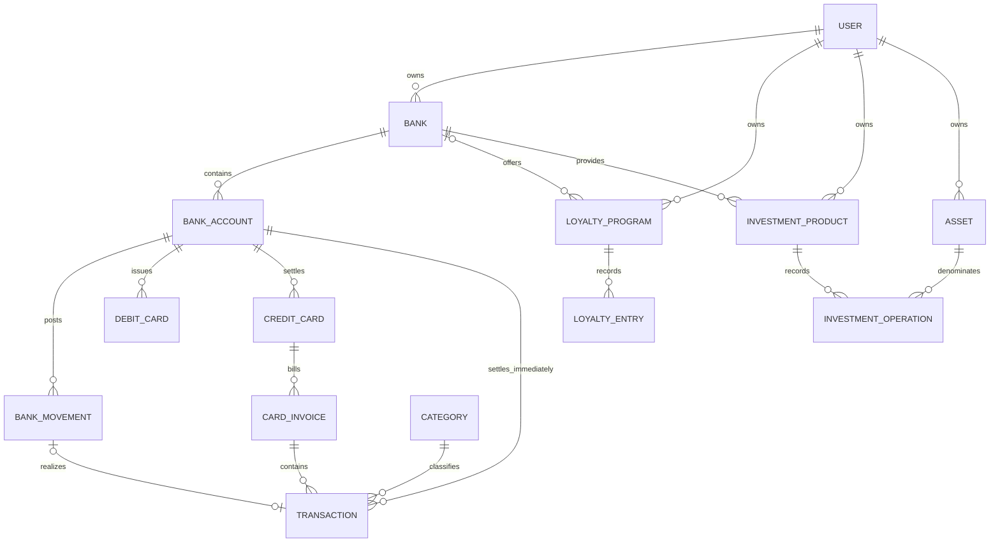

# Data Model

The approved clean schema and its business rules. The release is intentionally
breaking: old `PaymentMethod`, payment, institution, transaction, and investment
rows are not migrated. See [Breaking release](#breaking-release).

## Entity-relationship diagram

## Banking

### `BankingProfile`

`BankingProfile` is one-to-one with the native Django user and stores
`base_currency`. The project `CURRENCY` setting remains only the signup/default
value. Changing a user's base currency changes future consolidation preferences;
it does not mutate native amounts or historical conversion snapshots.

### `Bank`

| Field | Meaning |
|---|---|
| `user` | Owner; all names and relationships are user-scoped. |
| `name` | Bank, broker, exchange, or other financial provider. |
| timestamps | `created_at`, `updated_at`. |

`Bank` is the shared provider entity used by banking, loyalty, and investments.
The former investment-only `Institution` model is removed.

### `BankAccount`

| Field | Meaning |
|---|---|
| `bank` | Owning `Bank`. |
| `name` | User-facing account label. |
| `currency` | Native ISO 4217 currency; immutable after the first movement. |
| `opening_balance` | Native balance immediately before the first ledger entry. |
| `pix_enabled` | Account capability, `True` by default. |
| timestamps | `created_at`, `updated_at`. |

A bank has many accounts; currency does not identify an account. Multiple BRL,
USD, or other accounts under the same bank are valid.

### `BankMovement`

| Field | Meaning |
|---|---|
| `account` | Ledger being changed. |
| `amount` | Positive amount in the account's currency. |
| `direction` | `CREDIT` or `DEBIT`; determines the sign. |
| `kind` | `OPENING_ADJUSTMENT`, `TRANSACTION`, `TRANSFER`, `INVOICE_PAYMENT`, `INVESTMENT`, `REVERSAL`, or `ADJUSTMENT`. |
| `occurred_on` | Real settlement date. |
| `transaction` | Optional economic event realized by the movement. |
| `invoice` | Required for `INVOICE_PAYMENT`. |
| `transfer_id` | Shared immutable identifier for the two sides of an own transfer. |
| `exchange_rate` | Historical rate used when the paired side has another currency. |

`available_balance = opening_balance + credits - debits`. This ledger is the
only source of account balance. Source-backed rows are synchronized when their
transaction, invoice, transfer, investment, or reward source changes.

### Cards and invoices

`DebitCard(account, name, last_four, active)` and
`CreditCard(account, name, last_four, closing_day, due_day, active)` both belong
to one account. A `CardInvoice` belongs to a credit card and records statement
start/end, due date, native currency, status, item total, and its settlement
movement.

A debit purchase creates a transaction and immediate debit movement. A credit
purchase creates a transaction assigned to one invoice and no immediate
movement. On the invoice due date, payment creates one `INVOICE_PAYMENT` debit
for the invoice payable total. Dashboard logic must never add invoice purchases
to account balance separately from that payment.

## Transactions

| Field | Meaning |
|---|---|
| `user` | Owner. |
| `description` | User-facing economic-event description. |
| `amount`, `currency` | Positive native amount and ISO currency. |
| `base_amount`, `exchange_rate` | Historical conversion to the user's base currency. |
| `transaction_type` | `INCOME`, `EXPENSE`, or `TRANSFER`. |
| `category` | Required for income/expense; absent for own transfers. |
| `occurred_on` | Purchase or economic-event date. |
| `settlement_kind` | `PIX`, `DEBIT_CARD`, `CREDIT_CARD`, `ACCOUNT`, or `TRANSFER`. |
| settlement links | The owned account/card/invoice and optional realizing movement. |
| recurrence fields | Optional schedule used to project future events. |
| timestamps | `created_at`, `updated_at`. |

An external PIX is a normal `INCOME` or `EXPENSE`; it creates its immediate
movement. A transfer between owned accounts is `TRANSFER`, creates paired
movements, and is excluded from income and expense. Investments are no longer a
transaction type: their cash legs use investment movements and their position
history remains in `investments`.

## Categories

### `Category`

`Category(user, name, parent_category, created_at, updated_at)` retains the
existing income/expense classification. Names are unique per user, parent
choices are user-scoped, and `Transaction.category` uses `PROTECT`. Deleting a
parent sets its children to top level; deleting a category referenced by
transaction history is blocked.

## Loyalty

`LoyaltyProgram` has a name, points unit, optional `Bank`, optional many-to-many
card links, and owner. It is valid with none of those links.

`LoyaltyEntry` is a points ledger with `points` and kind
`INVOICE_AWARD`, `PURCHASE`, `ADJUSTMENT`, `EXPIRATION`, or `REDEMPTION`.
Invoice awards may reference an invoice; all entries retain event date and
notes. Balance is the signed sum of entries.

A redemption additionally requires `target_amount`, `target_currency`, and
`iof_amount`. If `iof_amount > 0`, exactly one owned IOF funding instrument is
required: bank account, debit card, or credit card. Its settlement follows the
same immediate/deferred card rules as any other payment.

## Currency and historical conversion

The user has one base currency for consolidated reporting, but operational data
is natively multicurrency. Every monetary event retains its native amount and
currency. `ExchangeRate(from_currency, to_currency, rate, effective_date)` is
unique per owner/pair/date. Existing rates are not edited or deleted in the UI.

Historical reports resolve the rate effective on the event date and retain that
rate or the resulting `base_amount`. A newer rate affects only newer events and
current simulations; it never revalues historical cash flow. Native totals are
always available. Missing conversion is displayed as missing and excluded from
the consolidated base total with an explicit warning.

## Investments

Investments remain a separate position ledger and reuse `Bank`; they do not use
`Institution` and do not become ordinary `Transaction` rows.

### Structure

Assets are either unit-valued or monetary. Monetary assets, such as savings
pots, record operations directly as currency amounts and may hold a non-negative
opening balance for money that existed before tracking started. This opening
balance contributes to the current position but has no linked bank movement.

| Entity | Required fields |
|---|---|
| `InvestmentProduct` | owner, `bank`, name, product kind. |
| `Asset` | owner, name, code, `asset_class`, currency. |
| `InvestmentOperation` | owner, product, asset, kind, quantity, unit price, currency, date. |

`asset_class` is mandatory (for example `CASH`, `FIXED_INCOME`, `EQUITY`, `FUND`,
`CRYPTO`, or `OTHER`). An operation has no `title`; identity comes from product,
asset, kind, and date. Gross value is `quantity * unit_price`, preserving both
position quantity and historical execution price.

Operation kinds are `DEPOSIT`, `WITHDRAWAL`, and `YIELD`:

- `DEPOSIT` requires a source `BankAccount` and a linked debit
  `BankMovement(kind=INVESTMENT)`.
- `WITHDRAWAL` requires a destination `BankAccount` and a linked credit movement.
- `YIELD` is internal to the investment position. It changes quantity/value but
  does not create bank income or an account movement.

The source/destination account currency may differ from the asset currency; the
operation retains native values and its historical conversion. Deposit and
withdrawal cash legs are never manually duplicated as income/expense.

## Dashboard formulas

- **Available balance per account:** opening balance plus its posted movements.
- **Consolidated available balance:** each account balance converted to base at
  the report's applicable historical/current rate, with missing rates disclosed.
- **Income/Expenses:** categorized `Transaction` economic events, excluding own
  transfers and investment cash legs.
- **Credit-card payable:** open invoice totals, shown separately from available
  cash until settlement.
- **Net worth:** available bank balances plus investment valuation minus open
  card invoices. Invoice purchases and invoice payment movements must not both
  reduce the same component.

## Integrity

- All entities are owned directly or transitively by one user; cross-user foreign
  keys are invalid even if primary keys are guessed.
- Categories, banks, accounts, cards, products, assets, rates, and loyalty
  programs referenced by history use protective deletion.
- Derived ledger rows are idempotently synchronized from their source records.
- Monetary amounts are positive; direction/kind carries their accounting sign.

## Breaking release

This schema ships through a clean migration reset. The release removes
`payments.PaymentMethod`, replaces `payments` with `banking`, removes investment
`Institution`, and changes transaction and investment identities and foreign
keys. Existing databases are not upgraded in place: back up/export if needed,
delete the SQLite database and historical migration files as specified by the
release procedure, create fresh migrations, migrate, and recreate/import data
against the new schema. No automatic legacy-data conversion is approved.
