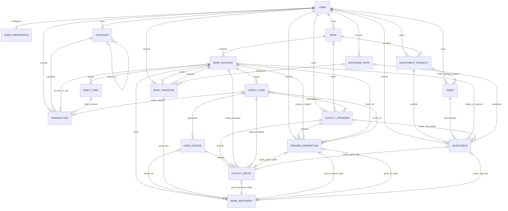
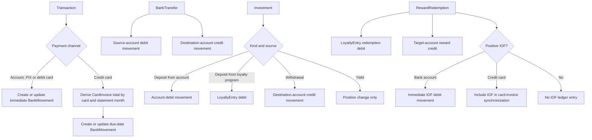

# Data Model

The current schema and its business rules. Legacy financial rows are not
automatically migrated. See [Breaking release](#breaking-release).

## Entity-relationship diagram

Every financial model also carries a direct `user` foreign key, even when the
diagram emphasizes its domain relationship. Optional edges reflect nullable
foreign keys. Business services enforce stronger rules where the database shape
alone cannot—for example, a transfer posts exactly two movements and a
transaction selects exactly one payment instrument.

`Transaction` does not have a foreign key to `CardInvoice` or `BankMovement`.
The idempotent ledger synchronization service derives immediate movements and
card-invoice totals from the transaction's channel, instrument, date and
recurrence fields. It also pre-creates future-effective rows; realized cash
queries include only movements effective through the requested date. The generated movement's `source_key` preserves that source
identity without creating a model relationship.

## Posting and data flow

The service layer posts each workflow atomically and synchronizes derived rows
idempotently. `BankMovement` remains the source of realized account cash;
transactions, invoices, investment positions and loyalty points retain their
separate economic meaning.

## Banking

### `UserPreference`

`UserPreference` belongs to the native Django user through a one-to-one
relationship and stores `base_currency`, chosen from the supported currency
registry, plus the user's `date_format` presentation preference. The row is
created on signup and a data migration safely creates it
for existing users with the BRL bootstrap default. It is a presentation
preference: changing it never rewrites native account, transaction, investment,
or exchange-rate data.

Public registration does not add a profile or registration model. The
`ALLOW_SIGNUPS` environment setting controls whether the native Django `User`
creation route is open; disabling it leaves existing user rows and login
behavior untouched.

### `Bank`

| Field | Meaning |
|---|---|
| `user` | Owner; all names and relationships are user-scoped. |
| `name` | Bank, broker, exchange, or other financial provider. |
| timestamps | `created_at`, `updated_at`. |

`Bank` is the shared provider entity used by banking, loyalty, and investments.
The former investment-only `Institution` model is removed.

### `BankAccount`

| Field | Meaning |
|---|---|
| `bank` | Owning `Bank`. |
| `name` | User-facing account label. |
| `currency` | Native ISO 4217 currency; immutable after the first movement. |
| `opening_balance` | Native balance immediately before the first ledger entry. |
| `pix_enabled` | Account capability, `True` by default. |
| timestamps | `created_at`, `updated_at`. |

A bank has many accounts; currency does not identify an account. Multiple BRL,
USD, or other accounts under the same bank are valid.

### `BankMovement`

| Field | Meaning |
|---|---|
| `account` | Ledger being changed. |
| `amount` | Positive amount in the account's currency. |
| `direction` | `CREDIT` or `DEBIT`; determines the sign. |
| `kind` | `INCOME`, `EXPENSE`, `TRANSFER`, `INVOICE`, `INVESTMENT`, `REWARD`, or `ADJUSTMENT`. |
| `effective_date` | Settlement date used for balance calculation. |
| `description` | Optional user-facing movement description. |
| `invoice` | Optional one-to-one invoice settlement link. |
| `transfer` | Optional link to the two-sided `BankTransfer`. |
| `source_key` | Optional per-user idempotency key for a source-backed movement. |

`available_balance = opening_balance + credits - debits`. This ledger is the
only source of account balance. Source-backed rows are synchronized when their
transaction, invoice, transfer, investment, or reward source changes.

### Cards and invoices

`DebitCard(user, account, name)` and
`CreditCard(user, account, name, card_type, closing_day, due_day)` both belong to one
account. A `CardInvoice` belongs to a credit card and records reference month,
due date, amount, status, paid timestamp and its settlement movement.

A debit purchase creates a transaction and immediate debit movement. A credit
purchase has no direct invoice foreign key: synchronization groups it by card
and statement month into a `CardInvoice`, with no purchase-date account debit.
The invoice has one due-date `INVOICE` movement for its payable total. Dashboard
logic must never add invoice purchases to account balance separately from that
movement.

## Transactions

| Field | Meaning |
|---|---|
| `user` | Owner. |
| `title` | User-facing economic-event title. |
| `amount` | Positive native amount in the selected settlement account/card currency. |
| `transaction_type` | `INCOME` or `EXPENSE`. |
| `category` | Required income/expense category; the form displays a parent as `Parent > Category`. |
| `date` | Purchase or economic-event date. |
| `payment_channel` | `PIX`, `DEBIT_CARD`, `CREDIT_CARD`, or `ACCOUNT`. |
| settlement links | Exactly one owned account, debit card or credit card, according to the channel. |
| recurrence fields | Optional schedule used to project future events. |
| timestamps | `created_at`, `updated_at`. |

An external PIX is a normal `INCOME` or `EXPENSE`; it creates its immediate
movement. A transfer between owned accounts is a separate `BankTransfer`,
creates paired movements, and is excluded from income and expense. Investments
are not a transaction type: their cash legs use investment movements and their
position history remains in `investments`.

## Categories

### `Category`

`Category(user, name, transaction_type, parent_category, created_at, updated_at)` retains the
existing income/expense classification. `transaction_type` is optional: an
unclassified category remains valid for both types, while a typed category is
validated against its matching transaction type. Migration `categories.0002`
leaves existing categories unclassified; it does not relabel categories or
financial records. A used category cannot be classified incompatibly with its
existing transactions. Names are unique per user, parent
choices are user-scoped, and `Transaction.category` uses `PROTECT`. Deleting a
parent sets its children to top level; deleting a category referenced by
transaction history is blocked.

### Category classification migration

`categories.0002_category_transaction_type` adds a nullable category type with
no data migration. Upgrade normally with `manage.py migrate`; rollback with
`manage.py migrate categories 0001` removes only this optional classification.
Neither direction changes transactions or financial amounts.

Creating an account seeds only the nine approved top-level category names,
localized once from the account-creation language and defined in
`categories.signals`; it does not create synthetic transactions,
banks, accounts, cards, investments, or shared credentials.

## Loyalty

`LoyaltyProgram` has a name, points unit, optional `Bank`, optional many-to-many
card links, and owner. It is valid with none of those links.

`LoyaltyEntry` is the signed points ledger. It stores a positive `amount`, a
`CREDIT` or `DEBIT` direction, and kind
`INVOICE_AWARD`, `PURCHASE`, `ADJUSTMENT`, `EXPIRATION`, or `REDEMPTION`.
Invoice awards may reference an invoice. Purchased points store their cash
amount and exactly one funding account or credit card; all entries retain event
date and notes. Balance is the signed sum of entry amounts.

`RewardRedemption` is the orchestration record for a monetary redemption. It
stores the points, target account and amount, IOF amount, date and optional IOF
account or credit card. Its target currency comes from the target account. The
posting service links it to the generated redemption `LoyaltyEntry`, reward
credit movement and, for account-funded IOF, debit movement. If `iof_amount >
0`, exactly one owned IOF account or credit card is required; zero IOF permits
neither. Credit-card IOF is included by the invoice synchronization flow.

## Currency and historical conversion

Each user's `UserPreference.base_currency` controls reporting. Every monetary
event retains its native amount and currency. Cross-currency `BankTransfer` and
`Investment` rows also persist an FX snapshot containing source/target
currencies, numeric rate, effective date, optional source-rate reference, and
conversion status. Numeric evidence remains authoritative if that reference is
later edited or deleted. New and existing users default to BRL.
A preference change affects consolidated presentation only; it never silently
converts or relabels stored financial data.

Historical transfer and investment reports use the persisted snapshot, so
changing or deleting an `ExchangeRate` cannot rewrite those prior totals.
Current/manual rates are used only for explicitly labeled current valuations.
If no rate exists, native data is preserved and conversion is marked
incomplete. Existing rows are reconstructed only when an authoritative rate
supplies evidence; no rate is guessed. Other entities remain on live/current
conversion until a future roadmap item extends snapshot coverage.
Editing an amount, currency, fees, or date refreshes its snapshot, while
descriptive edits leave it unchanged. If the reporting currency later differs
from the stored snapshot target, historical consolidation is marked incomplete;
the application does not chain a mutable second rate or replace the evidence.

### User preference migration and rollback

The `accounts.0001_userpreference` migration creates the one-to-one preference
table and bootstraps BRL for users already in the database. It does not touch
financial rows or exchange rates. Upgrade with `manage.py migrate`; rollback to
the previous migration removes only the preference rows/table and restores the
previous project-level reporting behavior in code. Back up the local SQLite
database before applying or rolling back migrations.

## Investments

Investments remain a separate position ledger and reuse `Bank`; they do not use
`Institution` and do not become ordinary `Transaction` rows.

### Structure

Assets are either unit-valued or monetary. Monetary assets, such as savings
pots, record operations directly as currency amounts and may hold a non-negative
opening balance for money that existed before tracking started. This opening
balance contributes to the current position but has no linked bank movement.
Unit-valued assets may likewise record an opening quantity and unit price,
linked to the product that already holds the position. This initial position is
available for later withdrawals and also has no linked bank movement.

| Entity | Required fields |
|---|---|
| `InvestmentProduct` | owner, `bank`, name, yield mode. |
| `Asset` | owner, name, code, `asset_class`, currency, valuation mode. |
| `Investment` | owner, product, asset, kind and date; valuation and funding fields depend on the selected modes. |

`asset_class` is mandatory: `LIQUIDITY`, `CURRENCY`, `CRYPTO`, `FIXED_INCOME`,
`EQUITY`, or `OTHER`. An `Investment` has no `title`; identity comes from
product, asset, kind, and date. Unit-valued assets derive gross value as
`quantity * unit_price`; monetary assets use their positive `amount` directly.

Operation kinds are `DEPOSIT`, `WITHDRAWAL`, and `YIELD`:

- `DEPOSIT` requires exactly one source: a `BankAccount` with a linked debit
  `BankMovement(kind=INVESTMENT)`, or a `LoyaltyProgram` with a linked redemption
  `LoyaltyEntry`.
- `WITHDRAWAL` requires a destination `BankAccount` and a linked credit movement.
- `YIELD` is internal to the investment position. It changes quantity/value but
  does not create bank income or an account movement.

For monetary assets, the operation form can receive either the positive yield
amount or the balance after the credit. In the latter case, the application
derives and persists the positive `amount` as `final balance - prior position`.
The final balance is not stored separately. The prior position includes the
opening balance only for its holding product and then applies earlier
operations; operations dated equally use registration order.

The source/destination account currency may differ from the asset currency; the
operation retains native values and a historical FX snapshot when conversion is
required. Deposit and withdrawal cash legs are never manually duplicated as
income/expense.

## Dashboard formulas

- **Available balance per account:** opening balance plus its posted movements.
- **Consolidated available balance:** current reporting uses the user's
  `UserPreference.base_currency`; persisted FX evidence protects supported
  historical conversions from later rate changes.
- **Income/Expenses:** categorized `Transaction` economic events, excluding own
  transfers and investment cash legs.
- **Credit-card payable:** open invoice totals, shown separately from available
  cash until settlement.
- **Net worth:** available bank balances plus investment valuation minus open
  card invoices. Invoice purchases and invoice payment movements must not both
  reduce the same component.

## Integrity

- All entities are owned directly or transitively by one user; cross-user foreign
  keys are invalid even if primary keys are guessed.
- Categories, banks, accounts, cards, products, assets, rates, and loyalty
  programs referenced by history use protective deletion.
- Derived ledger rows are idempotently synchronized from their source records.
- Monetary amounts are positive; direction/kind carries their accounting sign.

## Local database lifecycle

The schema is distributed through Django migrations, not through a committed
SQLite file. On a clean clone, `manage.py migrate` creates the installation's
local `db.sqlite3`. Git ignores that root file and its journal/WAL companions.
The installation owner controls the resulting financial data and is responsible
for access protection and backups.

Detailed SQLite backup/restore, retention and rehearsal guidance is maintained
in [`operations.md`](operations.md).

### FX snapshot migration and rollback

The FX snapshot migrations add persisted evidence to cross-currency
`BankTransfer` and `Investment` rows. Existing rows are backfilled only when a
matching authoritative `ExchangeRate` provides evidence; those rows are marked
reconstructed. Rows without evidence keep their native amounts and receive an
incomplete conversion status—no rate is inferred. The migrations do not change
native amounts or delete exchange-rate rows. Back up SQLite before upgrading.
Rolling back removes only the new snapshot fields and restores read-time
conversion behavior; it does not alter native financial rows or the
`ExchangeRate` table.

Migrations `banking.0004` and `investments.0005` add explicit effective-date
and optional source-rate evidence. Existing transfers use their event date;
investments link a rate only when its numeric value exactly matches the retained
snapshot. A missing or changed source reference does not invalidate the retained
numeric evidence. Rolling these migrations back removes only that metadata.

## Breaking release

This schema has no in-place upgrade from earlier releases. Back up/export data
if needed, create a fresh database through migrations, and recreate or import
records against the current schema. No automatic legacy-data conversion is
approved.
